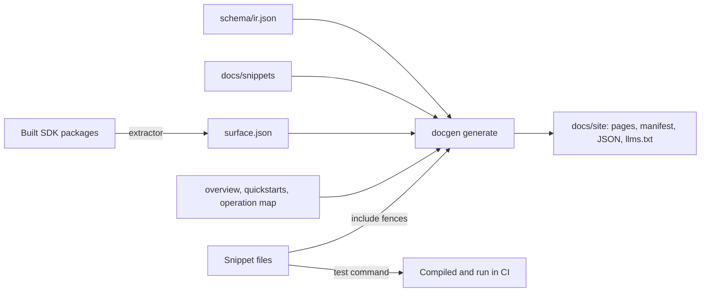

# Docs pipeline

`tools/docgen` generates the SDK documentation in [`docs/site`](site) from
the [IR](sdk-generation.md#the-ir), each SDK's public API and hand-written
pages whose code comes from tested snippets. It writes framework-neutral
Markdown that renders the same on GitHub and as MDX, JSON for navigation and
reference data, and `llms.txt` files for LLMs and agents. A website renders
this output. Nothing here depends on a particular site generator.



## Commands

```sh
npm run build                              # the TypeScript extractor reads built declarations
npm run extract:docs -- typescript         # write docs/languages/typescript/surface.json
npm run generate:docs                      # write docs/site
npm run check:docs                         # fail if docs/site is out of date
npm run test:docs -- --install typescript  # install, type-check and run the TypeScript snippets
npm run test:docgen                        # the generator's own tests
```

`node tools/docgen/cli.mjs --help` describes the options. `extract` and
`test` take language IDs and default to every language. `extract --check`
fails when a committed surface is out of date. `generate` reads the
committed surfaces, so it needs only Node.js 22 or later, never a language's
toolchain. docgen itself has no npm dependencies.

`generate` checks every input and every page before it writes anything, and
reports all problems at once with their files and lines. Its output is
deterministic: everything is sorted and nothing records a time.

The Docs workflow, [`.github/workflows/docs.yml`](../.github/workflows/docs.yml),
runs the generator's tests, `check:docs`, and the TypeScript
`extract --check` and snippet tests on every pull request.

## Inputs

| Path | Contents |
| --- | --- |
| `schema/ir.json` | Operations, types and annotations. `npm run generate:graphql` generates it. |
| `docs/snippets/` | One language-neutral page per operation, from the [`doc-snippets` emitter](sdk-generation.md#documentation-snippets) |
| `tools/docgen/docgen.config.mjs` | The documentation's title and description, and the quickstart topics in navigation order |
| `docs/languages/<id>/language.json` | The language: its name, status, packages, quickstarts, snippet roots, extractor and test commands ([`language.schema.json`](../spec/docs/language.schema.json)) |
| `docs/languages/<id>/overview.md` | The start of the language's home page |
| `docs/languages/<id>/quickstarts/<topic>.md` | One quickstart for each topic the language's SDKs support |
| `docs/languages/<id>/operations.json` | The public members that send each operation ([`operation-map.schema.json`](../spec/docs/operation-map.schema.json)) |
| `docs/languages/<id>/surface.json` | The packages' public API, which `extract` writes ([`surface.schema.json`](../spec/docs/surface.schema.json)). Don't edit it by hand. |
| `docs/languages/<id>/<snippet root>/` | Code that quickstarts include, which the language's test command compiles and runs. TypeScript's is `examples/src`, in [an npm package](languages/typescript/examples) with its own lockfile. |

The quickstart topics are `server`, `client`, `webhooks`, `push` and
`calling`. A language writes the quickstarts that its SDKs support: one with
only a server SDK skips `client` and `calling`.

## Output

Everything under `docs/site` is generated. `npm run check:docs` fails when a
file is missing, edited or stale, and `generate` deletes the files it no
longer writes. Don't edit or merge these files by hand. If a rebase
conflicts in `docs/site`, take either side, run `npm run generate:docs` and
commit the result.

### Layout

```text
docs/site/
├── README.md                  Not a page: says the directory is generated
├── index.md                   Home: languages, quickstarts by topic and API operations
├── manifest.json              Navigation and metadata for every page
├── llms.txt                   Links for LLMs and agents
├── llms-full.txt              Every page in one file
├── operations/
│   ├── index.md               Every API operation
│   ├── index.json             Operations with the SDK members that send them
│   └── <plane>/<field>.md     One page per operation
└── <language>/
    ├── index.md               Overview, packages, quickstarts and reference
    ├── llms-full.txt          The language's pages in one file
    ├── quickstarts/<topic>.md
    └── reference/
        ├── index.md           The language's packages
        ├── <slug>.md          One page per package
        ├── <slug>.json        The same reference as data
        └── operations.md      The members that send each operation
```

Language IDs, topics and package slugs are lowercase kebab-case. Paths are
case-sensitive: operation pages use the GraphQL field name, such as
`operations/communication/sendMessage.md`. A language can't use the ID
`operations`, and a package can't use the slug `index` or `operations`.
There are no images or other binary files.

### Manifest

[`manifest.json`](site/manifest.json)
([`manifest.schema.json`](../spec/docs/manifest.schema.json)) is a website's
entry point. Its paths are relative to `docs/site`.

- `title` and `description` describe the documentation.
- `topics` lists the quickstart topics in navigation order, each with an ID,
  title and summary.
- `languages` lists the languages in navigation order. Each has its status
  (`preview` or `stable`), its code fence language, and the paths of its
  home page, reference index, operation coverage page and `llms-full.txt`.
  Each also lists its packages, with their name, slug, layer (`server` or
  `client`), summary, runtime, source directory, reference page and data,
  and its quickstarts, with their topic and path.
- `operations` gives the operation index page and its data.
- `llms` gives `llms.txt` and `llms-full.txt`.
- `pages` lists every page except `README.md`, in reading order. Each has
  its `path`, `kind`, `title` (its H1 as plain text) and `description` (its
  first paragraph as plain text). Pages also name their `language`, `topic`,
  `package` or `operation` when one applies.

| Kind | Path | Names |
| --- | --- | --- |
| `home` | `index.md` | |
| `language` | `<language>/index.md` | `language` |
| `quickstart` | `<language>/quickstarts/<topic>.md` | `language`, `topic` |
| `reference-index` | `<language>/reference/index.md` | `language` |
| `reference` | `<language>/reference/<slug>.md` | `language`, `package` |
| `coverage` | `<language>/reference/operations.md` | `language` |
| `operation-index` | `operations/index.md` | |
| `operation` | `operations/<plane>/<field>.md` | `operation` |

`pages` is complete, so a website can build its routes, navigation and page
metadata from the manifest without listing the directory.

### Markdown

Pages use a subset of CommonMark with GFM tables that renders the same as
Markdown and as MDX. docgen checks every page against it, generated or
hand-written:

- A page starts with its only H1, followed by a one-paragraph description.
  These are its `title` and `description` in the manifest. Pages have no
  front matter.
- Headings are ATX headings (`## Title`) in the first column, without
  closing `#` characters, and contain only text and code spans.
- A heading's ID is its [github-slugger](https://github.com/Flet/github-slugger)
  slug, as GitHub and [rehype-slug](https://github.com/rehypejs/rehype-slug)
  make it, and is unique within its page. Anchors in links use these IDs.
- Code is in fenced code blocks, each with a language. Code spans stay on
  one line. MDX doesn't support indented code blocks, so a line indented
  4 or more spaces past its container (the page or a list item) must
  continue a paragraph.
- A fence starts on its own line, after no list marker, indented at most
  3 spaces past its container, and isn't in a block quote. In a list item,
  the fence, its code and its closing fence are indented at least as far
  as the item's text, so CommonMark keeps them in the item.
- Outside code, `<`, `{` and `}` are escaped with a backslash. Pages contain
  no HTML, comments, autolinks, images or reference-style links, and no line
  starts with `import` or `export`.
- Documentation comments from source code keep their Markdown, but their
  headings become bold paragraphs, so they can't clash with page headings.
- Links are `https:`, `mailto:` or relative paths to generated files, with
  optional anchors. A relative link resolves from the path of the page that
  contains it, as on GitHub. Every target and anchor exists.

A renderer must keep those heading IDs:

- Slug each heading's source text with rehype-slug or another github-slugger
  implementation. Don't apply smart punctuation, such as
  remark-smartypants, to headings: it changes the text that rehype-slug
  sees, so the IDs of headings that contain `--` or `---` no longer match
  their links.
- rehype-sanitize prefixes IDs with `user-content-` by default (its
  `clobberPrefix` option). If a site sanitizes these pages, set
  `clobberPrefix` to `""` or rewrite anchors to match, or links to headings
  break.

### Tested code

A hand-written page never contains code in one of its language's tested
fences. It includes a region of a snippet file instead, and the language's
test command compiles and runs that file. In a snippet file, the language's
line comment marks a region:

```ts
// #region connect
import { ProjectServerClient } from "@convohop/server";
// …
// #endregion connect
```

A quickstart includes it with an empty fence. The path is relative to the
language directory, and leaving out `#connect` includes the whole file:

````md
```ts include=examples/src/server.ts#connect
```
````

docgen drops the marker lines, dedents and trims the code, and copies it into
the page. The fence names the code's source as a repository path:

````md
```ts snippet=docs/languages/typescript/examples/src/server.ts#connect
import { ProjectServerClient } from "@convohop/server";
…
```
````

The info string's first word is the language. remark and MDX keep the rest
as the code node's `meta`, so a renderer can label the block as tested and
link to its source in this repository. Code in other fences, such as `sh`,
`json` and `text`, isn't tested.

Tested fences match without regard to case, so a fence whose language is
`TS` is tested too. An include fence can be indented in a list item; the included
code keeps its indentation, so it stays in the item. An included file must
resolve inside its snippet root once symbolic links are followed, and
docgen reads a language's pages, snippet roots, operation map and
`surface.json` only from inside its directory.

### JSON data

Each JSON file starts with a `$schema` that points to its schema in
[`spec/docs`](../spec/docs), relative to the file. Links in JSON files, the
`page` fields, are relative to the JSON file, as a page's links are relative
to the page.

- `<language>/reference/<slug>.json`
  ([`reference.schema.json`](../spec/docs/reference.schema.json)) is a
  package's reference as data. Each symbol and member has its kind,
  reference, heading ID on the reference page, signatures, documentation,
  deprecation and the operations it sends. A symbol that another package
  declares names that package in `origin`.
- `operations/index.json`
  ([`operation-index.schema.json`](../spec/docs/operation-index.schema.json))
  lists every operation with its plane, kind, GraphQL field and operation
  name, layer, summary and page. For each language, it lists the SDK members
  that send the operation, with links to their headings. An empty list means
  the language doesn't wrap the operation.

A reference has the form `<package>#<Symbol>[.<member>...]`, with `:static`
after the name of a static member, for example
`@convohop/server#ServerConversation.messages.send`. Operation maps use the
same references.

### llms.txt

- `llms.txt` follows [llmstxt.org](https://llmstxt.org/): an H1, a summary
  in a block quote, a short paragraph, then lists of links with descriptions:
  one for each language and one for the API operations.
- `llms-full.txt` contains every page in manifest order. Each page starts
  with its H1, and a blank line separates pages.
- `<language>/llms-full.txt` contains only that language's pages.

Links in these files are relative to the file that contains them and, like
the pages' links, point to `.md` paths.

### Rendering on a website

A website, such as ConvoHop's, can render `docs/site` from a pinned commit
of this repository:

1. Read `manifest.json`. Build routes and navigation from `pages`,
   `languages` and `topics`, and page metadata from each page's `title` and
   `description`.
2. Map each page path to a route, for example
   `typescript/quickstarts/server.md` to `/docs/typescript/quickstarts/server`.
   When building, resolve each relative link against the source path of the
   page that contains it, then map the target to its route. Keep anchors
   unchanged.
3. Render pages with a CommonMark and GFM pipeline, or as MDX, with the
   heading IDs described in [Markdown](#markdown).
4. Use the `snippet=` meta to label tested code and link to its source.
5. Serve `llms.txt`, `llms-full.txt` and each language's `llms-full.txt` as
   plain text, with their links mapped the same way.

The layout, the manifest and the JSON schemas are the contract with the
website. Change them only by adding to them. Any other change needs a
matching website change.

## Adding a language

A language plugs in with a directory under `docs/languages` and an
extractor. docgen itself doesn't change. Use
[TypeScript's directory](languages/typescript) as the model. The language
directory is a real directory, not a symbolic link, and the files docgen
reads from it resolve inside it.

1. **Describe the language** in `docs/languages/<id>/language.json`
   ([`language.schema.json`](../spec/docs/language.schema.json)). Paths are
   relative to that directory, except each package's `source`, which is
   relative to the repository root. Commands are argument vectors that
   docgen runs from the repository root without a shell. `node` runs the
   Node.js that runs docgen.

   | Field | Value |
   | --- | --- |
   | `id` | The directory name, which `docs/site` also uses |
   | `name`, `order` | The display name, and its position in navigation. TypeScript's `order` is 10. |
   | `status` | `preview` until the SDK is released and supported, then `stable` |
   | `codeFence` | The info string of rendered code blocks, such as `ts` |
   | `testedFences` | Every info string that pages may use only through include fences, including `codeFence`. Matching ignores case. |
   | `regionComment` | The line comment before region markers, such as `//` or `#`. Leave it empty where `#region` is itself a directive, as in C#. |
   | `snippetRoots` | The directories whose files pages may include. The test command must compile or run every file in them. |
   | `packages` | The documented packages in display order, each with its name, slug, layer (`server` or `client`), summary, runtime and source directory |
   | `quickstarts` | The topics that have a quickstart |
   | `operations` | The operation map's file name, usually `operations.json` |
   | `extract.command` | The extractor |
   | `test.install` | Installs the snippets' dependencies from a lockfile. Optional. |
   | `test.command` | Compiles every file under the snippet roots and runs their tests |

2. **Write the extractor.** It prints the packages' public API as JSON
   ([`surface.schema.json`](../spec/docs/surface.schema.json)) on standard
   output and exits 0. docgen adds `$schema` and writes `surface.json`. Use
   the language's own tools, such as its compiler or documentation tool, and
   map its declarations onto the surface's kinds. For example, a protocol or
   trait is an `interface`, and an enum's cases are `case` members. The
   extractor must:

   - list the packages in `language.json` order, and each package's symbols
     sorted by name in code-unit order;
   - include only the public API, with signatures in the language's syntax
     and documentation comments as Markdown;
   - list overloads as one member with several signatures, and inherited
     members after the type's own members, nearest base first, with
     `inherited` naming the base;
   - name the declaring package in `origin` when a package re-exports a
     symbol from another;
   - produce the same output for the same input, and fail with a message
     that names the file and declaration it can't document, instead of
     skipping it.

   TypeScript's extractor,
   [`tools/docgen/extractors/typescript.mjs`](../tools/docgen/extractors/typescript.mjs),
   reads the `.d.ts` files of the built packages. A listed package can be a
   subpath export, such as `@convohop/client/push`: the extractor reads that
   entry's `types` condition, and the subpath's own declarations get no
   `origin`, because its package declares them. It follows bases by name,
   including through namespace imports such as `core.BaseClient`. It doesn't
   list members inherited from globals or third-party packages, and fails
   for a workspace base whose members it can't read, such as a mixin
   constant or an intersection type. Declarations take one variable per
   statement.

3. **Map the operations** in `operations.json`. For each operation ID in
   `schema/ir.json`, list the references of the public members that send it.
   docgen checks that each reference exists in the surface and that the
   operation's layer allows the package's layer. Pages show an operation
   without an entry as not wrapped by a method.

4. **Write the pages.** `overview.md` starts the language's home page: an
   H1, a one-paragraph description, then sections such as how the packages
   fit together, how to install them and how the examples are tested.
   docgen adds the packages, quickstarts and reference after it. Write
   `quickstarts/<topic>.md` for each topic in `quickstarts`. Pages follow the
   [Markdown rules](#markdown), and their relative links resolve from where
   they are written in `docs/site`. For example, a quickstart links to a
   reference heading as `../reference/server.md#<heading-id>`, to the
   language's home page as `../index.md`, and to an operation as
   `../../operations/management/issueBackendKey.md`.

5. **Add tested snippets.** Put the example code under a snippet root, mark
   regions with the language's line comment, and include them as described
   in [Tested code](#tested-code). Regions can nest. A code block in a
   tested fence without `include=` fails generation, so every sample is
   compiled or run.

6. **Generate the docs.** Build the SDK, then run:

   ```sh
   npm run extract:docs -- <id>
   npm run generate:docs
   npm run test:docs -- --install <id>
   ```

   Commit the language directory, including `surface.json`, and `docs/site`.

7. **Check them in CI.** The SDK's own workflow has its toolchain. After it
   builds the SDK, it sets up Node.js 22 or later and runs:

   ```sh
   node tools/docgen/cli.mjs extract --check <id>
   node tools/docgen/cli.mjs test --install <id>
   ```

   The Docs workflow runs `npm run check:docs` on every pull request, which
   checks every language's pages without its toolchain. Add a Dependabot
   entry for the snippets' lockfile.

## Changing docgen

- Run `npm run test:docgen`, then `npm run generate:docs`, and review the
  diff in `docs/site` with the code change.
- Add tests to `tools/docgen/test/`. They build small fixture sites in
  temporary directories.
- Changes to the layout, the manifest or the JSON schemas reach the
  website. Make them additive, and tell the website's maintainers.
