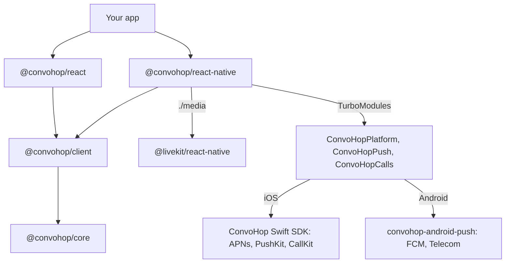

# React Native SDK design

[`@convohop/react-native`](../packages/react-native/README.md) runs the
TypeScript client SDK, [`@convohop/client`](../packages/client/README.md),
in React Native apps. It adds push notifications and calls in the system
call UI through the iOS and Android SDKs' native helpers, and media through
LiveKit's React Native SDK. This document describes how it's built, what
its native modules do on each platform and what has been verified.

## Status

The package is built in two phases.

| Part | Phase | State |
| --- | --- | --- |
| Platform adapter, `createPlatform` | 1 | Written. Tested on Node.js with the globals Hermes lacks removed. Run on Hermes once, by hand, in the example on an Android emulator and once on an iOS simulator. |
| JavaScript API for push, calls and media | 1 | Written. Tested against fakes of the native modules, React Native and LiveKit. |
| Codegen specs for `ConvoHopPlatform`, `ConvoHopPush` and `ConvoHopCalls` | 1 | Written. The tests run React Native 0.87.1's Codegen on them. React Native 0.76.0's Codegen generated them once, by hand. |
| Conformance driver | 1 | Runs the shared scenarios through `createPlatform` against the mock. |
| Example app's JavaScript | 1 | Written and type-checked. |
| Android: Kotlin modules, Gradle build and the example's `android/` project | 2 | Written. CI runs the JVM tests and builds the example. The example ran once, by hand, on an Android 15 emulator; see [Testing](#testing). |
| iOS: Swift modules, podspec and the example's `ios/` project | 2 | Written. CI builds the example for the iOS simulator. The example ran once, by hand, on an iOS 27 simulator; see [Testing](#testing). |
| Push delivery, calls and media on devices | 2 | Android calls and notifications ran on the emulator, from pushes passed to `handleRemoteMessage`. On the iOS simulator, pushes sent with `simctl push` reached JavaScript and rang CallKit, but the simulator ends calls before anyone can answer them. Not run: delivery through FCM or APNs, answered calls on iOS, media and physical devices. |

## Scope

Goals:

- Reuse `@convohop/core` and `@convohop/client` unchanged. Web and React
  Native share one implementation of the protocol, the outbox, replay,
  receipts, live sessions and push payload parsing.
- Keep one implementation of push and calls per platform: wrap the iOS and
  Android SDKs' helpers instead of writing them again.
- Work before JavaScript runs. A VoIP push must reach CallKit, a call must
  ring, and a push for another user must be dropped while the app starts
  or stays suspended.
- Join calls with LiveKit's official React Native SDK and ConvoHop's
  admission, as
  [Calls with the official LiveKit SDKs](sdk-strategy.md#calls-with-the-official-livekit-sdks)
  describes.

Not in scope:

- React Native's legacy architecture. The native modules are TurboModules
  only, so the floor is React Native 0.76, the first release with the New
  Architecture on by default. Its Codegen reads the specs' event emitters.
- React Native before 0.84 on iOS. The podspec adds the Swift SDK as a
  local Swift package, and React Native's `spm_dependency` takes a local
  path from 0.84. On older releases, `pod install` fails with an error
  that says so.
- Expo Go, which can't load other native modules. Expo development builds
  need a config plugin; see [Open questions](#open-questions).
- UI components.

## Layers

- `createPlatform()` gives `@convohop/client` the runtime services that
  Hermes lacks, through the client's `platform` option. The client has no
  React Native code.
- Hooks come from [`@convohop/react`](../packages/react/README.md), which
  imports only `react` and `@convohop/client`, never `react-dom`. Its
  `useMediaConnection` is for browsers; React Native apps connect calls
  with `@convohop/react-native/media`.
- `@convohop/react-native/media` is a separate entry point, so apps without
  calls don't install or load LiveKit.
- The package ships its specs in `src/specs`, and the app's build runs
  Codegen on them. The Codegen library is `RNConvoHopSpec`, and the Android
  package is `com.convohop.reactnative`.

## Platform seams

The client reads each runtime service from its `platform` option and falls
back to the global of the same name. `createPlatform()` fills every seam
except `WebSocket`, which React Native has. Storage is a separate client
option with no default.

| Seam | Web | React Native |
| --- | --- | --- |
| Random UUIDs | `crypto.randomUUID()` | Version 4 UUIDs from `ConvoHopPlatform.getRandomBytes`: `SecRandomCopyBytes` on iOS and `SecureRandom` on Android. The native call is synchronous, because `randomUUID` is. |
| SHA-256, for request fingerprints | Web Crypto | JavaScript. The tests compare its digests with Web Crypto's. |
| `URL` | The global | `whatwg-url-without-unicode`, with the host lowercased, which the core's URL check needs. Hosts must be ASCII, so write internationalized domain names in Punycode. React Native's own `URL` is incomplete. |
| UTF-8 encoding | `TextEncoder` | `TextEncoder` where the runtime has it; otherwise the core encodes UTF-8 itself |
| WebSocket | The global | React Native's global `WebSocket` |
| Connectivity | `navigator.onLine` and its events | NetInfo's `isConnected`, when the app passes NetInfo. Unknown counts as online. |
| Lifecycle | `document.visibilityState` | `AppState`. `background` is background; `active` and iOS's `inactive` are active. |
| Recovery storage | `recoveryStorage`, such as `localStorage` | `asyncRecoveryStorage`: AsyncStorage, or anything with its promise API. It never holds tokens. |
| Outbox coordination | Web Locks, between tabs | Without Web Locks, outboxes in one JavaScript runtime coordinate in memory, and the next launch takes over what a killed one left. |
| Push registration | A Web Push subscription | APNs and PushKit tokens on iOS; an FCM token or Firebase installation ID on Android. See [Push](#push). |

**Timers in the background.** The client's timers are JavaScript timers.
iOS suspends JavaScript in the background, and Android can defer it. The
client doesn't depend on them there:

- When the app returns to the foreground, `scheduleSessionRefresh`
  re-checks a waiting renewal against the wall clock, and renews at once if
  it's due.
- The outbox and the realtime connection try again as soon as the app is
  active or the device is back online.
- The native helpers stop a ring at its `expiresAt` by themselves.
  `watchRingingCalls` also stops it then while JavaScript runs.

## Native modules

Three TurboModules implement the specs. Each module is optional at load
time: `TurboModuleRegistry.get` returns `null` for a missing one, and the
first function that needs it fails with an error that names it. Arguments
are checked in JavaScript before they reach native code, and native results
are checked before they reach the app.

| Module | Spec | Purpose |
| --- | --- | --- |
| `ConvoHopPlatform` | [`NativeConvoHopPlatform.ts`](../packages/react-native/src/specs/NativeConvoHopPlatform.ts) | Secure random bytes |
| `ConvoHopPush` | [`NativeConvoHopPush.ts`](../packages/react-native/src/specs/NativeConvoHopPush.ts) | Permission, registration, the push recipient, notifications |
| `ConvoHopCalls` | [`NativeConvoHopCalls.ts`](../packages/react-native/src/specs/NativeConvoHopCalls.ts) | Calls in CallKit or Telecom, the VoIP token, the iOS audio session |

The modules wrap the platform SDKs' helpers. They add no push parsing,
ledger or call state of their own, except where a table below says so.

### iOS

The modules wrap the [Swift SDK's](sdk-strategy.md#client-sdks) push and
call helpers: `ConvoHopCalls.shared` for PushKit and CallKit, and the
`ConvoHopPush` types for APNs payloads and tokens. They link only the
`ConvoHopPush` and `ConvoHopCalls` products.

- **Build.** React Native's iOS autolinking still reads a podspec, so the
  package ships a local `ConvoHopReactNative.podspec`. It isn't published
  to the CocoaPods trunk. It adds the Swift SDK with React Native's
  `spm_dependency`, as a local Swift package: this repository's `swift/`,
  or the checkout that `CONVOHOP_SWIFT_PACKAGE` names. A copy installed
  from npm has no `swift/`, so it needs `CONVOHOP_SWIFT_PACKAGE`; see
  [Open questions](#open-questions). `pod install` warns that a Swift
  package in a statically linked pod might cause linker errors. The example
  links statically and builds, because only this pod links the products.
  Resolving the package also downloads the Swift SDK's LiveKit
  dependencies, about 190 MB, though the app links none of them: its
  WebRTC is the `LiveKitWebRTC` pod that LiveKit's React Native SDK uses.
  The pod has a privacy manifest for the push ledger's `UserDefaults`.
- **App delegate.** iOS can launch the app for a VoIP push, and reports
  the notification that launched it only to a notification center delegate
  set during launch. So the app calls `ConvoHopReactNative.configure(_:)`
  in `application(_:didFinishLaunchingWithOptions:)`, before React Native
  starts, and forwards the APNs token callbacks to
  `didRegisterForRemoteNotifications(deviceToken:)` and
  `didFailToRegisterForRemoteNotifications(error:)`. `configure` starts
  `ConvoHopCalls.shared` with `start(configuration:delegate:)`, which
  registers for VoIP pushes, and becomes the notification center's
  delegate. It forwards other pushes, and `openSettingsFor`, to the
  delegate it replaced. An app that sets its own delegate later calls
  `ConvoHopReactNative.userNotificationCenter(_:willPresent:withCompletionHandler:)`
  and `userNotificationCenter(_:didReceive:withCompletionHandler:)` first
  from it; each returns `false`, without calling the completion handler,
  for a push it doesn't handle. The options' `appGroup` is the
  configuration's `ledgerSuiteName`, which the Notification Service
  Extension shares, and their `apnsEnvironment` goes with each
  registration. The package doesn't swizzle the app delegate. Until
  `configure` runs, `register`, `startOutgoingCall` and `setRecipient` with
  a recipient reject with `E_NOT_CONFIGURED`.
- **VoIP pushes.** `ConvoHopCalls.shared` reports every VoIP push to
  CallKit before `pushRegistry(_:didReceiveIncomingPushWith:)` returns, as
  iOS requires. Otherwise iOS terminates the app and, after repeated
  failures, stops delivering VoIP pushes. A push for another recipient is
  still reported, then ended at once.
- **Message pushes.** iOS shows a message push that arrives in the
  background itself: `CONVOHOP_MESSAGE`, or the push's text when the
  project opts in to previews. A Notification Service Extension can replace
  the text; it's native code that uses the Swift SDK's
  `ConvoHopNotificationService`, because React Native doesn't run in an
  extension. With the App Group's ledger, the extension also hides the text
  of a push for anyone but the recipient.

| Spec | iOS |
| --- | --- |
| `getRandomBytes` | `SecRandomCopyBytes` |
| `getPermissionStatus`, `requestPermission` | `UNUserNotificationCenter` authorization. Authorized and ephemeral are `granted`. `requestPermission` resolves the status after the request, also when iOS refuses it. |
| `register` | `registerForRemoteNotifications()`, and resolves. The app delegate forwards the token, and `onPushRegistration` reports it as lowercase hex, from `ConvoHopPushToken.hex`, with the options' `apnsEnvironment`. A failure the app delegate forwards is `onPushRegistrationError`. |
| `unregister` | Rejects with `E_UNSUPPORTED`: Apple advises apps not to unregister. The backend deletes the registrations. |
| `handleRemoteMessage` | Rejects with `E_UNSUPPORTED`: iOS delivers ConvoHop pushes through the notification center delegate. |
| `setRecipient` | `ConvoHopCalls.shared.recipient`: `.only(projectId:recipientId:)`, or `.nobody` for `null`. The Swift SDK keeps it in its push ledger, in the App Group's defaults when there is one, where the Notification Service Extension reads it. Nothing in the package sets `.any`, so `configure` turns a recipient that reads `.any`, which nothing set yet, into `.nobody`. See [Recipient filter](#recipient-filter). |
| `getRegistrations` | The latest APNs token this process received. `getPushRegistrations` adds the VoIP token from `getVoipToken`. |
| `onNotification`, `takeInitialNotification` | The notification center delegate, for pushes the recipient filter accepts. In the foreground, a message is `received` and shows as the options' `foregroundPresentation`. A call goes to `ConvoHopCalls.shared.handle`, which rings it, and doesn't show. A cancellation goes to `handle` too, which ends its ring, and shows only for a missed call. The default action on a notification is `opened`, after a call or cancellation goes to `handle`. The payload is `{"convohop": …}` with the notification's text. See [Cold start](#cold-start). |
| `getCalls`, `forgetCall` | `calls` and `forget`. An ended call stays in `calls` for a minute. |
| `startOutgoingCall` | `startOutgoingCall(liveSessionId:conversationId:handle:displayName:hasVideo:)` |
| `answerCall` | `answer`, which requests a CallKit action. A call that isn't ringing rejects with `E_CALL_STATE`. |
| `endCall` | `end` without a reason, which declines a ringing call and hangs up any other. It also resolves for a call that already ended, or an unknown one. |
| `stopRinging` | For a call that's still ringing, `end` with the reason, such as `answered`, which reports that the call ended elsewhere. It resolves for any other call. |
| `reportConnecting`, `reportConnected` | `reportConnecting` and `reportConnected`, for answered and outgoing calls. `reportConnecting` leaves a connected call connected. |
| `updateCall`, `setMuted` | `update` and `setMuted` |
| `setHeld` | `setHeld`, for an answered or outgoing call. Rejects with `E_UNSUPPORTED` unless the options' `supportsHolding` is on. |
| `setAudioRoute`, `openFullScreenIntentSettings` | Reject with `E_UNSUPPORTED`. Apps show the system route picker. |
| `canUseFullScreenIntent` | `true` |
| `getVoipToken`, `onVoipToken` | The PushKit token, from `didUpdateVoIPToken` |
| `isAudioSessionActive`, `onAudioSession` | CallKit's `didActivate` and `didDeactivate`. A provider reset deactivates it. |
| `onCallEvent` | The `ConvoHopCalls` delegate for `incoming`, `outgoing` and `answered`, and its calls observer for `changed` and `ended`. `incoming` comes once CallKit accepts the report, if the call is still ringing, so a ring that stops first reports only `ended`. |

The iOS modules reject with these codes. They're Android's, plus
`E_CALLKIT`.

| Code | When |
| --- | --- |
| `E_NOT_CONFIGURED` | `ConvoHopReactNative.configure` hasn't run. |
| `E_INVALID_ARGUMENT` | An argument JavaScript checks first, so apps don't see it |
| `E_CALL_NOT_FOUND`, `E_CALL_STATE` | No call has the ID, or the call's state doesn't allow the request. |
| `E_CALLKIT` | CallKit refused the request for another reason. The message has the error's domain and code. |
| `E_UNSUPPORTED` | `unregister`, `handleRemoteMessage`, `setAudioRoute`, `openFullScreenIntentSettings`, and `setHeld` without `supportsHolding`. JavaScript rejects the first four itself. |

### Android

The modules wrap the [Android SDK's](../android/README.md#push-notifications)
`com.convohop.android.push`: `ConvoHopFirebase` for registration and
`ConvoHopNotifications` for notifications and Telecom calls.

- **Build.** The package's Gradle module, in `android/`, depends on
  `com.convohop:convohop-android-push` and `firebase-messaging`. It reads
  `compileSdkVersion`, `minSdkVersion`, `convohopAndroidVersion` and
  `firebaseMessagingVersion` from the app's root `ext` when the app sets
  them. Until the Android SDK is on Maven Central, the example publishes
  this repository's push library to a local Maven repository,
  `android/build/repo`, and takes only the `com.convohop` group from there.
- **Manifest.** The app declares the Android SDK's
  `ConvoHopMessagingService` for `com.google.firebase.MESSAGING_EVENT`. If
  another library, such as React Native Firebase, owns that event, it
  passes ConvoHop data messages to `handleRemoteMessage`. The Android SDK's
  and LiveKit's manifests declare the permissions.
- **`MainApplication.onCreate`.** A push can start the process before
  JavaScript runs, so the app configures notifications there:
  `ConvoHopReactNative.configure(this, options)` instead of setting
  `ConvoHopNotifications.options`. It wraps the options' `recipientFilter`
  in the package's, and their `conversationIntent` in one that adds the
  push's payload, signed. It also adds the listener that the modules
  forward to JavaScript. The app passes its small icon and, optionally, a
  `MessageContentProvider` and its own call intents; without them, the
  Android SDK opens the launch activity. Until `configure` runs,
  `register`, `handleRemoteMessage` and `setRecipient` with a recipient
  reject with `E_NOT_CONFIGURED`.
- **Opened notifications.** The launch activity is exported, so any app
  can start it with extras of its choosing. The module therefore signs the
  payload it adds to a notification's intent with HMAC-SHA256, under a
  random key in the app's private preferences. It reports an opened
  notification only if the signature verifies, the push is for the stored
  recipient and the intent didn't come from the recent apps. It removes
  the payload from the intent, so it's reported once.
- **Calls.** Incoming calls ring through a self-managed Telecom
  `ConnectionService`, with a call-style notification and a full-screen
  intent. Android 14 grants `USE_FULL_SCREEN_INTENT` only to calling and
  alarm apps, and users can revoke it. Without it, the call rings as a
  heads-up notification. `canUseFullScreenIntent` says which applies, and
  `openFullScreenIntentSettings` opens the setting. The full-screen intent
  opens the app's `incomingCallIntent`, or the launch activity.
- **The lock screen.** The example's activity doesn't show over the lock
  screen. On a locked device, the ring wakes the screen, and the call rings
  as its notification on the lock screen, which answers and declines. On
  the Android 15 emulator, answering there dismissed a swipe lock. With a
  PIN, Android asked for it first, and the call kept ringing until the
  user entered it. To answer without unlocking, an app sets
  `incomingCallIntent` to its own activity with `showWhenLocked` and
  `turnScreenOn`, and answers there with `answerCall`.
- **Outgoing calls.** The Android SDK doesn't place outgoing Telecom calls.
  The app joins without the system call UI, and LiveKit's audio handling
  manages focus and Bluetooth.
- **Background.** Neither the Android SDK nor the module starts a
  foreground service. To keep a call's media running while the app is in
  the background, the app starts its own, of type `phoneCall`, as the
  [Android SDK](../android/README.md#calls) describes. The example doesn't:
  on the Android 15 emulator, Android blocked its network about 4 seconds
  after the screen turned off.

| Spec | Android |
| --- | --- |
| `getRandomBytes` | `SecureRandom` |
| `getPermissionStatus`, `requestPermission` | `POST_NOTIFICATIONS` on Android 13 and later, requested through the React Native activity; before that, `areNotificationsEnabled()`. The status is `undetermined` until the app has asked once. Requests made together share one prompt. If another library replaced the activity's permission listener, they settle when the app resumes. |
| `register`, `unregister` | `ConvoHopFirebase.register` and `unregister`, in the app's FCM mode: the registration token, or the Firebase installation ID when the manifest sets `firebase_messaging_installation_id_enabled`. The registration arrives through `onPushRegistration`. `unregister` resolves the registration it removed. |
| `onPushRegistration`, `onPushUnregistration`, `getRegistrations` | The listener's `onRegistered` and `onUnregistered`, and `ConvoHopNotifications.registration`. Android never emits `onPushRegistrationError`: `register` rejects instead. |
| `setRecipient` | Stores the IDs in the module's own `SharedPreferences`. The package's `RecipientFilter` accepts only that recipient, and only if the app's own filter accepts it too. See [Recipient filter](#recipient-filter). |
| `handleRemoteMessage` | `ConvoHopNotifications.handleNotification`, on the module's worker thread, because the app's `MessageContentProvider` may block |
| `onNotification` | The listener's `onMessage` is `received`. A tap opens the signed `conversationIntent`, and that's `opened`. The listener and intents get the parsed push, so the module writes its payload back as the `convohop` JSON. |
| `takeInitialNotification` | The notification that opened the activity, once. It waits for an activity, and resolves `null` once the app has resumed without one. A notification opened before it resolves goes to it rather than to `onNotification`. |
| `getCalls`, `forgetCall` | `calls()` and `forget` |
| `startOutgoingCall` | Rejects |
| `answerCall` | `answer` |
| `endCall` | `end`, which declines a ringing call and hangs up any other. It also resolves for a call that already ended, or an unknown one. |
| `stopRinging` | For a call that's still ringing, `handle` with a `CallCancelled` for the ring, as the server's cancellation push would be: the push ledger records the stop, and a missed call shows its notification. The ledger gives each ring one missed call, so the server's own cancellation shows no second one. Like that push, it passes the recipient filter: after `setPushRecipient(null)`, use `endCall`. |
| `reportConnecting`, `reportConnected` | The module's own state. The Android SDK's calls have no connecting state, so an answered call is `connecting` until `reportConnected` makes it `active`. |
| `setMuted` | The module's own state, until Telecom reports a mute change, because the Android SDK has no setter |
| `updateCall` | The module's own snapshot, because the Android SDK has no setter. The call's notification keeps the push's caller and video. |
| `setHeld`, `setAudioRoute` | `setOnHold` and `setAudioRoute` |
| `canUseFullScreenIntent`, `openFullScreenIntentSettings` | `canUseFullScreenIntent()`, and an activity for `fullScreenIntentSettings()` |
| `getVoipToken`, `isAudioSessionActive` | `null` and `false` |
| `onCallEvent` | The listener's call methods, and the module's own changes |

The Android modules reject with these codes. React Native puts the code
on the rejected `Error`'s `code`.

| Code | When |
| --- | --- |
| `E_NOT_CONFIGURED` | `ConvoHopReactNative.configure` hasn't run. |
| `E_FIREBASE_NOT_INITIALIZED` | `register` and `unregister` without Firebase, such as without `google-services.json` |
| FCM's code, such as `SERVICE_NOT_AVAILABLE`, or else `E_REGISTRATION` | FCM couldn't register or unregister. Only the code reaches JavaScript. |
| `E_NO_ACTIVITY` | `requestPermission` without a React Native activity |
| `E_STORAGE` | `setRecipient` couldn't write the recipient. |
| `E_INVALID_ARGUMENT` | An argument JavaScript checks first, so apps don't see it |
| `E_PUSH_HANDLER` | `handleRemoteMessage`'s handler failed, or the module is shutting down. |
| `E_CALL_NOT_FOUND`, `E_CALL_STATE` | No call has the ID, or the call's state doesn't allow the request. |
| `E_AUDIO_ROUTE` | The call has no system audio, or the route isn't available. |
| `E_UNSUPPORTED` | `startOutgoingCall`, and `openFullScreenIntentSettings` on a device without that setting |

## Push

1. After sign-in, on every launch, the app calls `setPushRecipient` with
   the user's project and principal IDs, then `registerForPush`.
2. `registerForPush` starts native registration and passes each
   registration to the app's `register` callback once, which stores it with
   the app's backend. iOS reports `{ kind: "apns" }` and, when the app
   receives calls, `{ kind: "apnsVoip" }`; Android reports `{ kind: "fcm" }`
   with a `token` or an `fid`. It resolves once the APNs token or the FCM
   registration is stored, and keeps passing new registrations until the
   app aborts its `signal` or calls the function it resolved. A
   registration the backend failed to store is offered again if the
   platform reports it again. When FCM unregisters one, the `unregister`
   callback deletes it from the backend.
3. ConvoHop sends the app's backend a signed webhook for each notification
   event. The backend builds the push with the server SDKs' helpers and
   sends it through APNs or FCM with its own credentials. ConvoHop never
   holds device tokens.
4. The native helpers show message notifications, ring calls and stop
   rings, with or without JavaScript. `onNotification` and
   `takeInitialNotification` give JavaScript each push's payload, parsed by
   `@convohop/client/push`, to update the UI or navigate.

### Recipient filter

A device keeps receiving a user's pushes until the backend deletes their
registrations, which can fail or come late, for example when the device is
offline at sign-out. So the device itself checks whom each push is for.

- `setPushRecipient({ projectId, recipientId })` stores the signed-in
  user's IDs on the device, through `ConvoHopPush.setRecipient`. The native
  handlers then drop every ConvoHop push for anyone else, including one
  that starts the app before JavaScript runs.
- Before the first call, and after `setPushRecipient(null)` at sign-out,
  they drop every ConvoHop push.
- The IDs are lowercase, non-nil UUIDs. JavaScript checks them before they
  reach native code. The device stores only the two IDs, never a token or
  other credential.
- On iOS, the recipient checks both IDs. A dropped VoIP push is still
  reported to CallKit, then ended at once. iOS shows a message push that
  arrives in the background itself; a Notification Service Extension with
  the App Group's ledger hides its text, leaving no title and a
  `CONVOHOP_*` string as the body.
- On Android, the Android SDK's `RecipientFilter` sees only the recipient
  ID. That's enough, because principal IDs are UUIDs.
- Until `setPushRecipient` resolves, the previous recipient applies. Apps
  check each push's IDs in JavaScript too.

### Cold start

A push can launch the app, or the user can open one that did. The native
module keeps the response or intent that launched the app, and
`takeInitialNotification` returns it once. A notification the user opens
before `takeInitialNotification` resolves goes to it too, rather than to
`onNotification`, so apps call it once at startup.

- On iOS, it resolves `null` a second after the app first became active if
  the user opened no notification; iOS delivers the launch response around
  then. If the user opened several, it gets the latest.
- On Android, an activity relaunched from the recent apps reports none.

Pushes received before JavaScript attaches its listener aren't replayed:
the native helpers have already shown or rung them.

## Calls

1. A call push rings in CallKit or Telecom without JavaScript.
2. The user answers in the system UI, on the lock screen or in the app with
   `answerCall`.
3. `subscribeAnsweredCalls` first replays the answered calls that are still
   current, then reports new ones, so a call answered before JavaScript
   started isn't lost. `forgetCall` drops an ended call from `getCalls()`.
4. The app joins the call's live session with `@convohop/client`, then
   connects media with `createRoomConnector`; see [Media](#media).
5. The call's state follows the system UI: `onCallEvent` reports
   `incoming`, `outgoing`, `answered`, `ended` and `changed`. Muting and
   holding go through the system call, and the app follows its `changed`
   events.

A ring stops when another device answers it, the caller hangs up or it
expires:

- On Android, the server's cancellation push stops it.
- iOS gets no VoIP push for that, because iOS would make the app report a
  VoIP push as a new call. A ring that ended or expired gets an alert push
  with `CONVOHOP_MISSED_CALL`; ConvoHop alert pushes that reach the app go
  to `ConvoHopCalls.shared.handle`, which ends that ring. A ring answered
  or declined on another device gets no push.
- `watchRingingCalls` lists the user's live alerts while a call rings, and
  stops a ring whose alert is gone from two complete listings in a row:
  with `ended` if its live session ended, `answered` if the user joined it
  and hasn't left, `expired` after its `expiresAt`, and `stopped`
  otherwise. It's how a running iOS app learns that a ring stopped, and on
  Android it covers a late or lost cancellation push. A listing that can't
  prove an alert is gone changes nothing. Once stopped, it starts no
  request and ignores the result or error of one in flight.
- Both native helpers stop a ring at its `expiresAt`, with or without
  JavaScript.

On iOS, outgoing calls start with `startOutgoingCall`, so CallKit owns
their audio too. The app joins, then reports `reportConnecting` and
`reportConnected`.

## Media

`@convohop/react-native/media` connects with LiveKit's React Native SDK.

- `setupMedia` runs first, at the top of the app's entry file. It gives the
  global `crypto` a secure `getRandomValues` and `randomUUID` where they're
  missing, so LiveKit doesn't fall back to `Math.random`, then calls
  LiveKit's `registerGlobals()`.
- **Admission.** `participation.connectWith(createRoomConnector(room))`
  gets each attempt's credentials from ConvoHop. The connector connects
  once with the attempt's single-use `connectToken`, with no retries of its
  own. LiveKit may resume that connection with the media server's refresh
  tokens. `onDisconnected` runs when the connection is lost past what
  resuming can fix, when the server removes the participant, and when
  LiveKit reconnects as a new participant. The app then connects again
  through `connectWith`, which gets new credentials. Cached credentials are
  never reused for a new connection.
- **Policy.** `createRoom()` has the Web SDK's media policy: one peer
  connection each way, no simulcast, adaptive stream or dynacast, and VP8
  video at up to 320x240, 15 frames per second and 350 kbit/s.
- **Capture.** Connecting doesn't capture. The app publishes the
  microphone and camera with `room.localParticipant`.
- **iOS audio.** With `setupMedia({ callKit: true })`, LiveKit doesn't
  configure the audio session. CallKit activates it for each call, and
  `ConvoHopCalls`' `onAudioSession` tells WebRTC through `RTCAudioSession`.
  `isAudioSessionActive` covers an activation that happened before
  JavaScript listened.
- **Android audio.** `MainApplication.onCreate` calls LiveKit's
  `LiveKitReactNative.setup` before React Native loads. The Telecom
  connection doesn't take audio focus. The app starts LiveKit's
  `AudioSession` before each call connects and stops it after.

## Sign-out

Everything that writes recovery state stops before the app deletes it:

1. Unmount the signed-in screens.
2. Stop `watchRingingCalls`, and abort `registerForPush`.
3. `setPushRecipient(null)`.
4. Stop `subscribeAnsweredCalls`, hang up, and `endCall` each call in
   `getCalls()` that hasn't ended. With no recipient, the native helpers
   drop the pushes that would stop a ring, so it would ring until it
   expires.
5. `await outbox.close()`, and wait for requests the app didn't await.
6. On Android, `unregisterFromPush()`.
7. Sign out with the backend, which ends the user's sessions and deletes
   their push registrations.
8. Clear the recovery storage.

On iOS, `unregisterFromPush` rejects: Apple advises apps not to
unregister, and the APNs and PushKit tokens don't change between users, so
the backend deletes the registrations. The
[example](../packages/react-native/example/src/session.ts) follows this
order.

## Security

- The app holds only the user's short-lived ConvoHop session, in memory.
  Backend keys stay in the app's backend.
- Recovery storage holds unconfirmed sends, replay cursors and the outbox.
  Native storage holds the push recipient's two IDs and the helpers' push
  ledgers. Neither holds a session token, `connectToken`, device token or
  FID.
- Device tokens, FIDs and `connectToken`s aren't logged. Errors name the
  failing step, not credentials.
- A Notification Service Extension that fetches message text uses its own
  short-lived session, in memory.
- The recipient filter keeps a previous user's pushes off the device's
  screen when their registrations outlive sign-out.
- Checks that protect the user run natively: the native helpers parse
  every push and apply the recipient filter themselves. JavaScript checks
  arguments only to give clear errors.

## Testing

What runs in CI, without a device:

- The package's `node:test` suite, against fakes of React Native, the
  native modules, LiveKit and WebRTC. It covers the platform adapter, the
  push and call APIs, the ring watcher, media setup and admission, and the
  package's exports.
- The client's send, outbox and push paths on `createPlatform`, on Node.js
  with the globals Hermes lacks removed, such as Web Crypto and a complete
  `URL`. `@convohop/react`'s hooks load there too, without `react-dom`.
- An outbox on a fake AsyncStorage across killed launches: queued messages
  outlive a kill, and a send cut off by one reaches the server once.
- React Native 0.87.1's Codegen on the specs, generating the iOS and
  Android interfaces. Checks that the fakes match the specs, and that each
  iOS module implements every method of its generated protocol.
- The shared [conformance scenarios](../spec/conformance/README.md), through
  the [React Native driver](../conformance/drivers/react-native/driver.mjs),
  against the mock. 41 pass, and the 34 that only use backend or management
  clients or verify webhooks are skipped. The
  [React Native workflow](../.github/workflows/react-native.yml) runs them,
  and also against the dev stack when the repository has one configured.
- A type check of the example app, and a test that its dependencies match
  the versions the package is tested with.
- The samples in the [React Native docs](site/react-native/index.md), in
  the workflow's docs job on Node.js 22 and 24. It checks that
  `docs/languages/react-native/surface.json` matches the built
  declarations, type-checks every sample, and runs the client samples
  against the conformance mock and the push samples against the native
  modules' stand-ins.
- The Android modules' JVM tests, and a debug build of the example for
  arm64-v8a, in the workflow's Android job. The tests cover the values and
  error codes sent to JavaScript, call snapshots, signed notification
  intents, the `convohop` JSON written back for the shared push payload
  vectors, and the recipient filter.
- A debug build of the example for the iOS simulator, in the workflow's
  iOS job, with Xcode 26.6 and the CocoaPods that the example's Gemfile
  resolves. It builds the iOS modules against the Swift SDK in `swift/`.
  It doesn't run the app.

The example also ran once, by hand, as a debug build on an Android 15
(API 35) arm64-v8a emulator, on Hermes with the New Architecture and
without Firebase. Pushes went in through `handleRemoteMessage`, the way
React Native Firebase passes them. That run verified:

- `createPlatform` on Hermes: random bytes and UUIDs, SHA-256 and `URL`.
  `ConvoHopClient` and a `ConversationStore` ran against the conformance
  mock, reached through `adb reverse`. A sent message was confirmed and
  left the outbox, another user's message arrived over the subscription,
  and counters stayed strings.
- Push: `registerForPush` rejecting with `E_FIREBASE_NOT_INITIALIZED`, the
  notification permission prompt, message notifications and opening one,
  and the recipient filter dropping pushes for another user or when there's
  no recipient.
- Calls: a ring with a call-style notification, and a duplicate push
  ignored. Answering in the app and from the notification, and declining
  from it. `reportConnecting`, `reportConnected`, mute, hold, `updateCall`
  and the speaker route; the emulator rejected the earpiece with
  `E_AUDIO_ROUTE`. `endCall`, twice. A cancellation push for each way the
  server stops a ring: `answered`, `declined`, `ended` and another reason.
  `stopRinging` with `ended`, and after answering. A ring expiring on the
  device, and a late cancellation ignored.
- The full-screen intent: denied, the call rang as a heads-up notification.
  With the screen off and no lock, it woke the device and opened the app.
  The [lock screen](#android) behaved as described above, with a swipe lock
  and with a PIN.
- No crashes.

The example also ran once, by hand, as a debug build on an iOS 27
simulator, built with Xcode 27.0, on Hermes with the New Architecture.
Pushes went in with `xcrun simctl push`, built with the server SDK's push
payload builders. That run verified:

- `createPlatform` on Hermes: random bytes and UUIDs, SHA-256 and `URL`.
  `ConvoHopClient` and a `ConversationStore` ran against the conformance
  mock. A sent message was confirmed and left the outbox, another user's
  message arrived over the subscription, and counters stayed strings.
- Push: the PushKit VoIP token, from `getVoipToken` and
  `getPushRegistrations`. Provisional permission, which needs no prompt. A
  message push in the foreground reached `onNotification` as `received`,
  and the recipient filter dropped a push for another user.
- Calls: a call push rang CallKit and reported `incoming`. A ring the
  system ended was `rejected`. A server cancellation with `ended`, before
  CallKit accepted the ring, ended it as `missed` and reported only
  `ended`; one with `expired` ended it as `expired`. A ring past its
  `expiresAt` never rang. `stopRinging` with `answered` ended a ring as
  `answeredElsewhere`. An outgoing call reported `outgoing`, and `hungUp`
  when the system ended it. Ended calls left `getCalls()` after a minute.
- The errors JavaScript gets for Android-only functions, ended calls and
  bad arguments.
- No crashes.

The simulator limits what can run there:

- It never delivered the APNs token, so `registerForPush` timed out
  waiting for it. The same was
  [reported](https://developer.apple.com/forums/thread/797507) for the iOS
  26.0 simulator. The VoIP token arrived.
- CallKit has no call UI there, and ended each call within three seconds
  of the report, so answering, connecting, muting and holding couldn't run.
- `simctl` can't grant notification permission, and the full prompt needs
  a tap.

Not verified:

- A release build, and React Native releases other than 0.87.1, including
  0.84 to 0.86 on iOS. React Native 0.76.0's Codegen generated the specs
  once, by hand; CI runs only 0.87.1's.
- The modules on physical devices, and the Android modules with Firebase
  configured.
- Push delivery through FCM and APNs, including VoIP pushes through
  PushKit.
- On iOS: answering, connecting, muting and holding calls, the audio
  session, the full permission prompt, opening a notification, a cold start
  from one, and a Notification Service Extension with an App Group.
- An app's own `incomingCallIntent` activity over the lock screen.
- Missed calls on the Android emulator with the current Android SDK, which
  changed how it posts them after that run.
- Real WebRTC media through LiveKit's React Native SDK.
- How Android's Telecom audio routes and LiveKit's audio session interact.
- AsyncStorage's behavior under concurrent writes on a device.
- React Native Firebase and the Android SDK's messaging service in one app,
  in each FCM mode.

## Assumptions

- **Wrap the platform SDKs.** The native modules wrap the Swift SDK's and
  the Android SDK's push and call helpers rather than reimplementing them.
  Their APIs fit, and each platform keeps one implementation of the push
  ledger, CallKit and Telecom. Where an API is missing, the module keeps
  its own state, as the Android table shows.
- **A local podspec with a local Swift package.** Autolinking needs a
  podspec, and a local one isn't affected by the CocoaPods trunk becoming
  read-only. Its `spm_dependency` adds the Swift SDK from a path, this
  repository's `swift/` or `CONVOHOP_SWIFT_PACKAGE`, because the Swift SDK
  has no package URL yet. React Native takes a local path from 0.84, so
  that's the floor on iOS, and the podspec checks it. Android keeps 0.76.
- **The Swift SDK's push and call products only.** The modules link
  `ConvoHopPush` and `ConvoHopCalls`. Apps get the client from
  `@convohop/client` and media from LiveKit's React Native SDK.
- **Configured from the app delegate, without swizzling.** The app calls
  `configure` and forwards the APNs token callbacks. The package replaces
  no app delegate methods, so an app that uses other push libraries decides
  the order.
- **`node:test`, not Jest.** The repository's packages test with Node's
  test runner. The fakes stand in for React Native, which Jest's React
  Native preset would otherwise provide.
- **One client per signed-in user.** The example claims the recovery
  storage for one user and clears it when another user signs in.
- **The app's FCM mode.** Android registers by token or by Firebase
  installation ID as the app's manifest selects. There's no ConvoHop
  option.
- **Drop pushes by default.** A device with no recipient, or a `null` one,
  shows and rings no ConvoHop push.
- **A local Maven repository for the Android SDK.** Until
  `com.convohop:convohop-android-push` is on Maven Central, the example and
  CI publish it from this repository's `android/` build to
  `android/build/repo`, and take only the `com.convohop` group from there.
  The package depends on `0.1.0-SNAPSHOT` unless the app sets
  `convohopAndroidVersion`.
- **React Native's template.** The example's `android/` and `ios/`
  projects are React Native 0.87.1's template.
  - Android: compile and target SDK 36, minimum SDK 24 and Gradle 9.4.1.
    It applies the Google services plugin only when the app has a
    `google-services.json`, so it builds and runs without Firebase.
  - iOS: iOS 15.1 or later, and the template's Gemfile and Bundler
    config, which installs the gems in the example's `vendor/bundle`. The
    app delegate configures the package. A scene delegate starts React
    Native, because apps built with the iOS 27 SDK must use scenes. The
    Podfile raises the deployment target of pods' resource bundles, such
    as AsyncStorage's, which Xcode 27 rejects.
- **No Podfile lock in the example.** The example doesn't commit
  `Podfile.lock`, `Gemfile.lock` or the workspace that `pod install`
  generates. Its pods follow `package-lock.json` and the podspecs. Today
  the Gemfile resolves CocoaPods 1.15.2.
- **The APNs environment from the build configuration.** The example
  registers Debug builds' tokens for APNs's development environment and
  Release builds' for production, as Xcode signs them by default.
- **No Notification Service Extension in the example.** It has no App Group
  either, so in the background iOS shows message pushes as "New message",
  from the example's `Localizable.strings`, unless the project sends
  previews. The Swift SDK
  [shows how to add one](../swift/README.md#message-text-in-a-notification-service-extension).
- **The example installs on its own.** It isn't one of the repository's
  workspaces. Its own `node_modules` and lockfile hold React Native,
  LiveKit and the other packages with native code, which must have one
  copy. Metro takes the SDK packages from the repository's workspaces, and
  autolinking links `@convohop/react-native` from `packages/react-native`.
- **No Dependabot entries for the example.** A test requires the example's
  dependencies to match the versions the package is tested with, so they
  change with those.
- **No foreground service.** Like the Android SDK, the package starts none.
  An app that keeps a call's media running in the background starts its
  own, of type `phoneCall`.

## Open questions

- **Swift package source.** A copy of the package installed from npm has no
  `swift/`, so apps set `CONVOHOP_SWIFT_PACKAGE` to a checkout of the Swift
  SDK. Once the Swift SDK has its own repository, the podspec can add it by
  URL and version instead.
- **LiveKit in the Swift package.** Resolving the Swift package downloads
  LiveKit's Swift SDK and its binary frameworks, about 190 MB, for the
  `ConvoHopLiveKit` product, which the modules don't link. A package of
  only the push and call products would avoid the download.
- **Android SDK setters.** The Android SDK has no setter for a call's mute
  state, caller name or video, and its calls have no connecting state. The
  module keeps its own until it does.
- **Android payload serializer.** The Android SDK's listener and intents
  get the parsed push, and only an incoming call serializes back to JSON,
  internally. The module writes the `convohop` JSON for `received` and
  `opened` itself until the SDK has a public serializer.
- **Expo.** A config plugin could add the manifest entries, app delegate
  calls and entitlements for Expo development builds.
- **Calls at a recipient change.** Neither native SDK ends the previous
  user's calls when the recipient changes, and with no recipient both drop
  the pushes that stop a ring. Apps end those calls at
  [sign-out](#sign-out). The SDKs could end them when the recipient
  changes.
