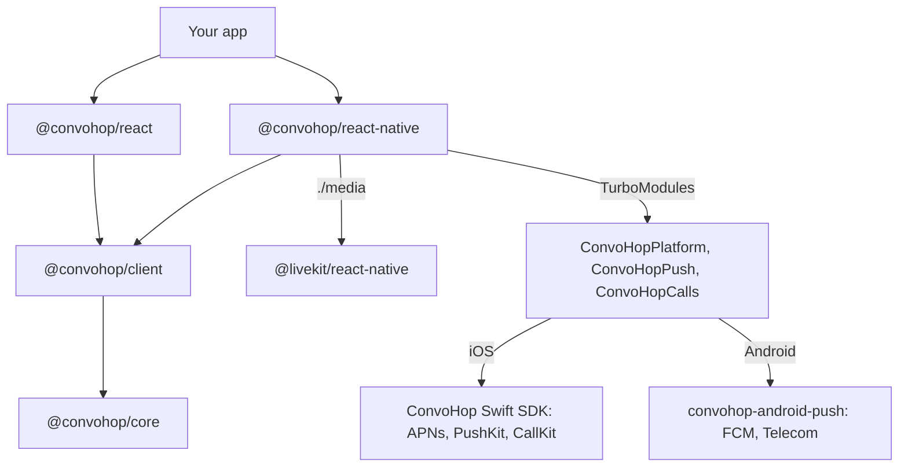

# React Native SDK design

[`@convohop/react-native`](../packages/react-native/README.md) runs the
TypeScript client SDK, [`@convohop/client`](../packages/client/README.md),
in React Native apps. It adds push notifications and calls in the system
call UI through the iOS and Android SDKs' native helpers, and media through
LiveKit's React Native SDK. This document describes how it's built, what
its native modules do on each platform and what has been verified.

## Status

The package is built in two phases.

| Part | Phase | State |
| --- | --- | --- |
| Platform adapter, `createPlatform` | 1 | Written. Tested on Node.js with the globals Hermes lacks removed. Not run on Hermes. |
| JavaScript API for push, calls and media | 1 | Written. Tested against fakes of the native modules, React Native and LiveKit. |
| Codegen specs for `ConvoHopPlatform`, `ConvoHopPush` and `ConvoHopCalls` | 1 | Written. The tests run React Native 0.87.1's Codegen on them. React Native 0.76.0's Codegen generated them once, by hand. |
| Conformance driver | 1 | Runs the shared scenarios through `createPlatform` against the mock. |
| Example app's JavaScript | 1 | Written and type-checked. |
| Native modules: Swift or Objective-C++ on iOS, Kotlin on Android | 2 | Not written. |
| Podspec, Gradle build and the example's `ios/` and `android/` projects | 2 | Not written. |
| Builds on a simulator and an emulator, and tests on devices | 2 | Not run. |

Until phase 2, an app can install the package but can't use it: each
function that needs a native module fails with an error that names it.

## Scope

Goals:

- Reuse `@convohop/core` and `@convohop/client` unchanged. Web and React
  Native share one implementation of the protocol, the outbox, replay,
  receipts, live sessions and push payload parsing.
- Keep one implementation of push and calls per platform: wrap the iOS and
  Android SDKs' helpers instead of writing them again.
- Work before JavaScript runs. A VoIP push must reach CallKit, a call must
  ring, and a push for another user must be dropped while the app starts
  or stays suspended.
- Join calls with LiveKit's official React Native SDK and ConvoHop's
  admission, as
  [Calls with the official LiveKit SDKs](sdk-strategy.md#calls-with-the-official-livekit-sdks)
  describes.

Not in scope:

- React Native's legacy architecture. The native modules are TurboModules
  only, so the floor is React Native 0.76, the first release with the New
  Architecture on by default. Its Codegen reads the specs' event emitters.
- Expo Go, which can't load other native modules. Expo development builds
  need a config plugin; see [Open questions](#open-questions).
- UI components.

## Layers

- `createPlatform()` gives `@convohop/client` the runtime services that
  Hermes lacks, through the client's `platform` option. The client has no
  React Native code.
- Hooks come from [`@convohop/react`](../packages/react/README.md), which
  imports only `react` and `@convohop/client`, never `react-dom`. Its
  `useMediaConnection` is for browsers; React Native apps connect calls
  with `@convohop/react-native/media`.
- `@convohop/react-native/media` is a separate entry point, so apps without
  calls don't install or load LiveKit.
- The package ships its specs in `src/specs`, and the app's build runs
  Codegen on them. The Codegen library is `RNConvoHopSpec`, and the Android
  package is `com.convohop.reactnative`.

## Platform seams

The client reads each runtime service from its `platform` option and falls
back to the global of the same name. `createPlatform()` fills every seam
except `WebSocket`, which React Native has. Storage is a separate client
option with no default.

| Seam | Web | React Native |
| --- | --- | --- |
| Random UUIDs | `crypto.randomUUID()` | Version 4 UUIDs from `ConvoHopPlatform.getRandomBytes`: `SecRandomCopyBytes` on iOS and `SecureRandom` on Android. The native call is synchronous, because `randomUUID` is. |
| SHA-256, for request fingerprints | Web Crypto | JavaScript. The tests compare its digests with Web Crypto's. |
| `URL` | The global | `whatwg-url-without-unicode`, with the host lowercased, which the core's URL check needs. Hosts must be ASCII, so write internationalized domain names in Punycode. React Native's own `URL` is incomplete. |
| UTF-8 encoding | `TextEncoder` | `TextEncoder` where the runtime has it; otherwise the core encodes UTF-8 itself |
| WebSocket | The global | React Native's global `WebSocket` |
| Connectivity | `navigator.onLine` and its events | NetInfo's `isConnected`, when the app passes NetInfo. Unknown counts as online. |
| Lifecycle | `document.visibilityState` | `AppState`. `background` is background; `active` and iOS's `inactive` are active. |
| Recovery storage | `recoveryStorage`, such as `localStorage` | `asyncRecoveryStorage`: AsyncStorage, or anything with its promise API. It never holds tokens. |
| Outbox coordination | Web Locks, between tabs | Without Web Locks, outboxes in one JavaScript runtime coordinate in memory, and the next launch takes over what a killed one left. |
| Push registration | A Web Push subscription | APNs and PushKit tokens on iOS; an FCM token or Firebase installation ID on Android. See [Push](#push). |

**Timers in the background.** The client's timers are JavaScript timers.
iOS suspends JavaScript in the background, and Android can defer it. The
client doesn't depend on them there:

- When the app returns to the foreground, `scheduleSessionRefresh`
  re-checks a waiting renewal against the wall clock, and renews at once if
  it's due.
- The outbox and the realtime connection try again as soon as the app is
  active or the device is back online.
- The native helpers stop a ring at its `expiresAt` by themselves.
  `watchRingingCalls` also stops it then while JavaScript runs.

## Native modules

Three TurboModules implement the specs. Each module is optional at load
time: `TurboModuleRegistry.get` returns `null` for a missing one, and the
first function that needs it fails with an error that names it. Arguments
are checked in JavaScript before they reach native code, and native results
are checked before they reach the app.

| Module | Spec | Purpose |
| --- | --- | --- |
| `ConvoHopPlatform` | [`NativeConvoHopPlatform.ts`](../packages/react-native/src/specs/NativeConvoHopPlatform.ts) | Secure random bytes |
| `ConvoHopPush` | [`NativeConvoHopPush.ts`](../packages/react-native/src/specs/NativeConvoHopPush.ts) | Permission, registration, the push recipient, notifications |
| `ConvoHopCalls` | [`NativeConvoHopCalls.ts`](../packages/react-native/src/specs/NativeConvoHopCalls.ts) | Calls in CallKit or Telecom, the VoIP token, the iOS audio session |

The modules wrap the platform SDKs' helpers. They add no push parsing,
ledger or call state of their own, except where a table below says so.

### iOS

The modules wrap the [Swift SDK's](sdk-strategy.md#client-sdks) push and
call helpers: `ConvoHopCalls.shared` for PushKit and CallKit, and its push
types for APNs payloads and tokens.

- **Build.** React Native's iOS autolinking still reads a podspec, so the
  package ships a local `ConvoHopReactNative.podspec`. It isn't published
  to the CocoaPods trunk. It takes the Swift SDK with React Native's
  `spm_dependency`, from the Swift package's repository.
- **App delegate.** iOS delivers APNs tokens, VoIP pushes and the launch
  notification to the app delegate, before JavaScript runs. The app calls
  the package's helpers from `application(_:didFinishLaunchingWithOptions:)`
  and the APNs token callbacks. At launch they start `ConvoHopCalls.shared`
  with `start(configuration:delegate:)`, which registers for VoIP pushes,
  and set the notification center's delegate. The configuration's
  `ledgerSuiteName` is the app's App Group, which the Notification Service
  Extension shares. The package doesn't swizzle the app delegate.
- **VoIP pushes.** `ConvoHopCalls.shared` reports every VoIP push to
  CallKit before `pushRegistry(_:didReceiveIncomingPushWith:)` returns, as
  iOS requires. Otherwise iOS terminates the app and, after repeated
  failures, stops delivering VoIP pushes. A push for another recipient is
  still reported, then ended at once.
- **Message pushes.** iOS shows a message push that arrives in the
  background itself: `CONVOHOP_MESSAGE`, or the push's text when the
  project opts in to previews. A Notification Service Extension can replace
  the text; it's native code that uses the Swift SDK's
  `ConvoHopNotificationService`, because React Native doesn't run in an
  extension. With the App Group's ledger, the extension also hides the text
  of a push for anyone but the recipient.

| Spec | iOS |
| --- | --- |
| `getRandomBytes` | `SecRandomCopyBytes` |
| `getPermissionStatus`, `requestPermission` | `UNUserNotificationCenter` authorization |
| `register` | `registerForRemoteNotifications()`. The app delegate passes the token to the module, which reports it as lowercase hex with `ConvoHopPushToken.hex`, with the APNs `environment` when the app's native setup names it. |
| `unregister` | Rejects: Apple advises apps not to unregister. The backend deletes the registrations. |
| `handleRemoteMessage` | Rejects: it's for FCM data messages |
| `setRecipient` | `ConvoHopCalls.shared.recipient`: `.only(projectId:recipientId:)`, or `.nobody` for `null`. The Swift SDK keeps it in the App Group, where the Notification Service Extension reads it. Nothing in the package sets `.any`, so at launch a recipient that reads `.any`, which nothing set yet, becomes `.nobody`. See [Recipient filter](#recipient-filter). |
| `getRegistrations` | The latest APNs token this process received |
| `onNotification`, `takeInitialNotification` | The notification center delegate: `willPresent` is `received`, `didReceive` is `opened`. The response that launched the app is kept for `takeInitialNotification`, once. ConvoHop alert pushes also go to `ConvoHopCalls.shared.handle`, so a missed-call alert ends its ring. |
| `getCalls`, `forgetCall` | `calls` and `forget` |
| `startOutgoingCall` | `startOutgoingCall(liveSessionId:conversationId:handle:displayName:hasVideo:)` |
| `answerCall`, `endCall` | `answer`, and `end` without a reason; each requests a CallKit action |
| `stopRinging` | `end` with the reason, such as `answered`, which reports that the call ended elsewhere |
| `reportConnecting`, `reportConnected` | `reportConnecting` and `reportConnected`, for answered and outgoing calls |
| `updateCall`, `setMuted`, `setHeld` | `update`, `setMuted` and `setHeld` |
| `setAudioRoute`, `openFullScreenIntentSettings` | Reject. Apps show the system route picker. |
| `canUseFullScreenIntent` | `true` |
| `getVoipToken`, `onVoipToken` | The PushKit token, from `didUpdateVoIPToken` |
| `isAudioSessionActive`, `onAudioSession` | CallKit's `didActivate` and `didDeactivate` |
| `onCallEvent` | The `ConvoHopCalls` delegate |

### Android

The modules wrap the [Android SDK's](../android/README.md#push-notifications)
`com.convohop.android.push`: `ConvoHopFirebase` for registration and
`ConvoHopNotifications` for notifications and Telecom calls.

- **Build.** The package's Gradle module depends on
  `com.convohop:convohop-android-push`. Until that's on Maven Central, the
  example builds against this repository's `android/` build as a Gradle
  composite build.
- **Manifest.** The app declares the Android SDK's
  `ConvoHopMessagingService` for `com.google.firebase.MESSAGING_EVENT`. If
  another library, such as React Native Firebase, owns that event, it
  passes ConvoHop data messages to `handleRemoteMessage`.
- **`MainApplication.onCreate`.** A push can start the process before
  JavaScript runs, so the app configures notifications there with the
  package's setup helper. The helper installs the package's
  `RecipientFilter`, sets the incoming and answered call intents to the
  app's activity, sets a `conversationIntent` that carries the push's
  payload, and adds the listener that the modules forward to JavaScript.
  The app passes its small icon and, optionally, a
  `MessageContentProvider`.
- **Calls.** Incoming calls ring through a self-managed Telecom
  `ConnectionService`, with a call-style notification and a full-screen
  intent. Android 14 grants `USE_FULL_SCREEN_INTENT` only to calling and
  alarm apps, and users can revoke it. Without it, the call rings as a
  heads-up notification. `canUseFullScreenIntent` says which applies, and
  `openFullScreenIntentSettings` opens the setting.
- **Outgoing calls.** The Android SDK doesn't place outgoing Telecom calls.
  The app joins without the system call UI, and LiveKit's audio handling
  manages focus and Bluetooth.

| Spec | Android |
| --- | --- |
| `getRandomBytes` | `SecureRandom` |
| `getPermissionStatus`, `requestPermission` | `POST_NOTIFICATIONS` on Android 13 and later; before that, `areNotificationsEnabled()` |
| `register`, `unregister` | `ConvoHopFirebase.register` and `unregister`, in the app's FCM mode: the registration token, or the Firebase installation ID when the manifest sets `firebase_messaging_installation_id_enabled` |
| `onPushRegistration`, `onPushUnregistration`, `getRegistrations` | The listener's `onRegistered` and `onUnregistered`, and `ConvoHopNotifications.registration` |
| `setRecipient` | Stores the IDs in `SharedPreferences` for the package's `RecipientFilter`. See [Recipient filter](#recipient-filter). |
| `handleRemoteMessage` | `ConvoHopNotifications.handleNotification`, off the main thread |
| `onNotification`, `takeInitialNotification` | The listener's `onMessage` is `received`. The listener and intents get the parsed push, so the module writes its payload back as the `convohop` JSON. A tap opens the app's activity through the `conversationIntent`, which carries that JSON, and that's `opened`. The intent that launched the app is kept for `takeInitialNotification`, once. |
| `getCalls`, `forgetCall` | `calls()` and `forget` |
| `startOutgoingCall` | Rejects |
| `answerCall` | `answer` |
| `endCall` | `reject` while the call rings; otherwise `end` |
| `stopRinging` | `handle` with a `CallCancelled` for the ring, so the push ledger records the stop as it would the server's cancellation |
| `reportConnecting`, `reportConnected` | The module's own state. The Android SDK's calls have no connecting state, so an answered call is `connecting` until `reportConnected` makes it `active`. |
| `setMuted` | The module's own state, combined with the mute Telecom reports, because the Android SDK has no setter |
| `updateCall` | The module's own snapshot, because the Android SDK has no setter |
| `setHeld`, `setAudioRoute` | `setOnHold` and `setAudioRoute` |
| `canUseFullScreenIntent`, `openFullScreenIntentSettings` | `canUseFullScreenIntent()`, and an activity for `fullScreenIntentSettings()` |
| `getVoipToken`, `isAudioSessionActive` | `null` and `false` |
| `onCallEvent` | The listener's call methods |

## Push

1. After sign-in, on every launch, the app calls `setPushRecipient` with
   the user's project and principal IDs, then `registerForPush`.
2. `registerForPush` starts native registration and passes each
   registration to the app's `register` callback once, which stores it with
   the app's backend. iOS reports `{ kind: "apns" }` and, when the app
   receives calls, `{ kind: "apnsVoip" }`; Android reports `{ kind: "fcm" }`
   with a `token` or an `fid`. It resolves once the APNs token or the FCM
   registration is stored, and keeps passing new registrations until the
   app aborts its `signal` or calls the function it resolved. A
   registration the backend failed to store is offered again if the
   platform reports it again. When FCM unregisters one, the `unregister`
   callback deletes it from the backend.
3. ConvoHop sends the app's backend a signed webhook for each notification
   event. The backend builds the push with the server SDKs' helpers and
   sends it through APNs or FCM with its own credentials. ConvoHop never
   holds device tokens.
4. The native helpers show message notifications, ring calls and stop
   rings, with or without JavaScript. `onNotification` and
   `takeInitialNotification` give JavaScript each push's payload, parsed by
   `@convohop/client/push`, to update the UI or navigate.

### Recipient filter

A device keeps receiving a user's pushes until the backend deletes their
registrations, which can fail or come late, for example when the device is
offline at sign-out. So the device itself checks whom each push is for.

- `setPushRecipient({ projectId, recipientId })` stores the signed-in
  user's IDs on the device, through `ConvoHopPush.setRecipient`. The native
  handlers then drop every ConvoHop push for anyone else, including one
  that starts the app before JavaScript runs.
- Before the first call, and after `setPushRecipient(null)` at sign-out,
  they drop every ConvoHop push.
- The IDs are lowercase, non-nil UUIDs. JavaScript checks them before they
  reach native code. The device stores only the two IDs, never a token or
  other credential.
- On iOS, the recipient checks both IDs. A dropped VoIP push is still
  reported to CallKit, then ended at once. iOS shows a message push that
  arrives in the background itself; a Notification Service Extension with
  the App Group's ledger hides its text, leaving no title and a
  `CONVOHOP_*` string as the body.
- On Android, the Android SDK's `RecipientFilter` sees only the recipient
  ID. That's enough, because principal IDs are UUIDs.
- Until `setPushRecipient` resolves, the previous recipient applies. Apps
  check each push's IDs in JavaScript too.

### Cold start

A push can launch the app, or the user can open one that did. The native
module keeps the response or intent that launched the app, and
`takeInitialNotification` returns it once. Pushes received before
JavaScript attaches its listener aren't replayed: the native helpers have
already shown or rung them.

## Calls

1. A call push rings in CallKit or Telecom without JavaScript.
2. The user answers in the system UI, on the lock screen or in the app with
   `answerCall`.
3. `subscribeAnsweredCalls` first replays the answered calls that are still
   current, then reports new ones, so a call answered before JavaScript
   started isn't lost. `forgetCall` drops an ended call from `getCalls()`.
4. The app joins the call's live session with `@convohop/client`, then
   connects media with `createRoomConnector`; see [Media](#media).
5. The call's state follows the system UI: `onCallEvent` reports
   `incoming`, `outgoing`, `answered`, `ended` and `changed`. Muting and
   holding go through the system call, and the app follows its `changed`
   events.

A ring stops when another device answers it, the caller hangs up or it
expires:

- On Android, the server's cancellation push stops it.
- iOS gets no VoIP push for that, because iOS would make the app report a
  VoIP push as a new call. A ring that ended or expired gets an alert push
  with `CONVOHOP_MISSED_CALL`; ConvoHop alert pushes that reach the app go
  to `ConvoHopCalls.shared.handle`, which ends that ring. A ring answered
  or declined on another device gets no push.
- `watchRingingCalls` lists the user's live alerts while a call rings, and
  stops a ring whose alert is gone from two complete listings in a row:
  with `ended` if its live session ended, `answered` if the user joined it
  and hasn't left, `expired` after its `expiresAt`, and `stopped`
  otherwise. It's how a running iOS app learns that a ring stopped, and on
  Android it covers a late or lost cancellation push. A listing that can't
  prove an alert is gone changes nothing. Once stopped, it starts no
  request and ignores the result or error of one in flight.
- Both native helpers stop a ring at its `expiresAt`, with or without
  JavaScript.

On iOS, outgoing calls start with `startOutgoingCall`, so CallKit owns
their audio too. The app joins, then reports `reportConnecting` and
`reportConnected`.

## Media

`@convohop/react-native/media` connects with LiveKit's React Native SDK.

- `setupMedia` runs first, at the top of the app's entry file. It gives the
  global `crypto` a secure `getRandomValues` and `randomUUID` where they're
  missing, so LiveKit doesn't fall back to `Math.random`, then calls
  LiveKit's `registerGlobals()`.
- **Admission.** `participation.connectWith(createRoomConnector(room))`
  gets each attempt's credentials from ConvoHop. The connector connects
  once with the attempt's single-use `connectToken`, with no retries of its
  own. LiveKit may resume that connection with the media server's refresh
  tokens. `onDisconnected` runs when the connection is lost past what
  resuming can fix, when the server removes the participant, and when
  LiveKit reconnects as a new participant. The app then connects again
  through `connectWith`, which gets new credentials. Cached credentials are
  never reused for a new connection.
- **Policy.** `createRoom()` has the Web SDK's media policy: one peer
  connection each way, no simulcast, adaptive stream or dynacast, and VP8
  video at up to 320x240, 15 frames per second and 350 kbit/s.
- **Capture.** Connecting doesn't capture. The app publishes the
  microphone and camera with `room.localParticipant`.
- **iOS audio.** With `setupMedia({ callKit: true })`, LiveKit doesn't
  configure the audio session. CallKit activates it for each call, and
  `ConvoHopCalls`' `onAudioSession` tells WebRTC through `RTCAudioSession`.
  `isAudioSessionActive` covers an activation that happened before
  JavaScript listened.
- **Android audio.** The Telecom connection doesn't take audio focus. The
  app starts LiveKit's `AudioSession` before each call connects and stops
  it after.

## Sign-out

Everything that writes recovery state stops before the app deletes it:

1. Unmount the signed-in screens.
2. Stop `watchRingingCalls`, and abort `registerForPush`.
3. `setPushRecipient(null)`.
4. Hang up, and stop `subscribeAnsweredCalls`.
5. `await outbox.close()`, and wait for requests the app didn't await.
6. On Android, `unregisterFromPush()`.
7. Sign out with the backend, which ends the user's sessions and deletes
   their push registrations.
8. Clear the recovery storage.

On iOS, `unregisterFromPush` rejects: Apple advises apps not to
unregister, and the APNs and PushKit tokens don't change between users, so
the backend deletes the registrations. The
[example](../packages/react-native/example/src/session.ts) follows this
order.

## Security

- The app holds only the user's short-lived ConvoHop session, in memory.
  Backend keys stay in the app's backend.
- Recovery storage holds unconfirmed sends, replay cursors and the outbox.
  Native storage holds the push recipient's two IDs and the helpers' push
  ledgers. Neither holds a session token, `connectToken`, device token or
  FID.
- Device tokens, FIDs and `connectToken`s aren't logged. Errors name the
  failing step, not credentials.
- A Notification Service Extension that fetches message text uses its own
  short-lived session, in memory.
- The recipient filter keeps a previous user's pushes off the device's
  screen when their registrations outlive sign-out.
- Checks that protect the user run natively: the native helpers parse
  every push and apply the recipient filter themselves. JavaScript checks
  arguments only to give clear errors.

## Testing

What runs in CI, without a device:

- The package's `node:test` suite, against fakes of React Native, the
  native modules, LiveKit and WebRTC. It covers the platform adapter, the
  push and call APIs, the ring watcher, media setup and admission, and the
  package's exports.
- The client's send, outbox and push paths on `createPlatform`, on Node.js
  with the globals Hermes lacks removed, such as Web Crypto and a complete
  `URL`. `@convohop/react`'s hooks load there too, without `react-dom`.
- An outbox on a fake AsyncStorage across killed launches: queued messages
  outlive a kill, and a send cut off by one reaches the server once.
- React Native 0.87.1's Codegen on the specs, generating the iOS and
  Android interfaces, and a check that the fakes match the specs.
- The shared [conformance scenarios](../spec/conformance/README.md), through
  the [React Native driver](../conformance/drivers/react-native/driver.mjs),
  against the mock. 33 pass, and the 31 that only use backend or management
  clients or verify webhooks are skipped. The
  [React Native workflow](../.github/workflows/react-native.yml) runs them,
  and also against the dev stack when the repository has one configured.
- A type check of the example app, and a test that its dependencies match
  the versions the package is tested with.

Not verified:

- Hermes, and React Native releases other than 0.87.1. React Native
  0.76.0's Codegen generated the specs once, by hand; CI runs only
  0.87.1's.
- Any native module, podspec or Gradle build, on any simulator, emulator
  or device.
- Push delivery, CallKit, Telecom and full-screen intents.
- Real WebRTC media through LiveKit's React Native SDK.
- How Android's Telecom audio routes and LiveKit's audio session interact.
- AsyncStorage's behavior under concurrent writes on a device.
- React Native Firebase and the Android SDK's messaging service in one app,
  in each FCM mode.

## Assumptions

- **Wrap the platform SDKs.** The native modules wrap the Swift SDK's and
  the Android SDK's push and call helpers rather than reimplementing them.
  Their APIs fit, and each platform keeps one implementation of the push
  ledger, CallKit and Telecom. Where an API is missing, the module keeps
  its own state, as the Android table shows.
- **A local podspec with `spm_dependency`.** Autolinking needs a podspec,
  and a local one isn't affected by the CocoaPods trunk becoming read-only.
  The Swift SDK stays a Swift package.
- **`node:test`, not Jest.** The repository's packages test with Node's
  test runner. The fakes stand in for React Native, which Jest's React
  Native preset would otherwise provide.
- **One client per signed-in user.** The example claims the recovery
  storage for one user and clears it when another user signs in.
- **The app's FCM mode.** Android registers by token or by Firebase
  installation ID as the app's manifest selects. There's no ConvoHop
  option.
- **Drop pushes by default.** A device with no recipient, or a `null` one,
  shows and rings no ConvoHop push.

## Open questions

- **Swift package source.** `spm_dependency` needs a remote package URL. The
  Swift SDK will be distributed from its own repository, which doesn't
  exist yet. Until then, phase 2 builds need another source for it.
- **Android SDK setters.** The Android SDK has no setter for a call's mute
  state, caller name or video, and its calls have no connecting state. The
  module keeps its own until it does.
- **Android payload serializer.** The Android SDK's listener and intents
  get the parsed push, and only an incoming call serializes back to JSON,
  internally. The module writes the `convohop` JSON for `received` and
  `opened` itself until the SDK has a public serializer.
- **Expo.** A config plugin could add the manifest entries, app delegate
  calls and entitlements for Expo development builds.
- **The example's lockfile.** The example will get its own lockfile with
  its native projects in phase 2.
