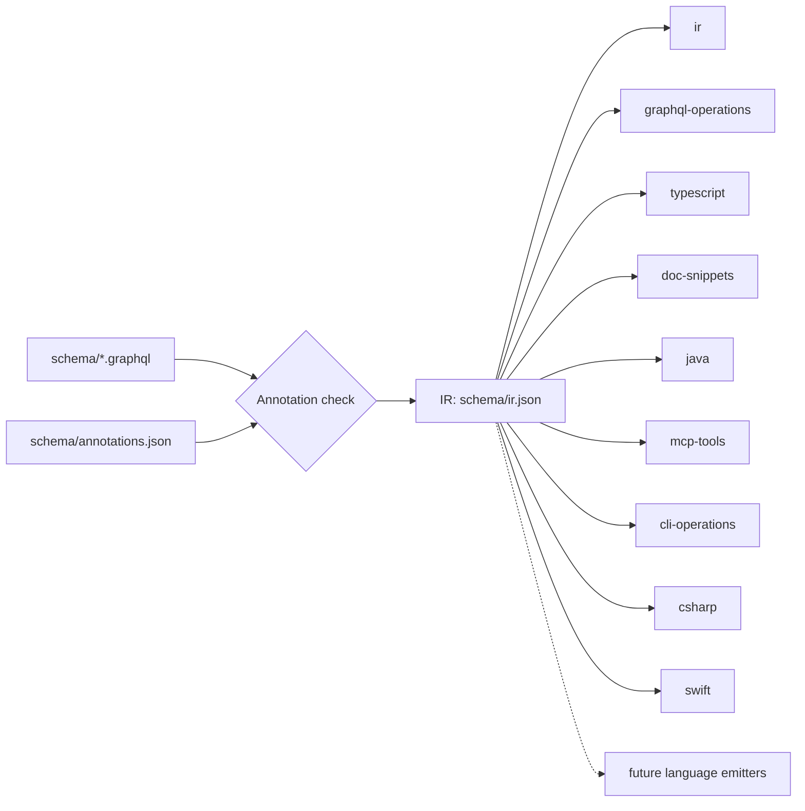

# SDK generation

Every ConvoHop SDK is generated from one language-neutral intermediate
representation (IR). The IR combines the GraphQL schemas that the ConvoHop API
exports with hand-written operation annotations. Each language has an emitter
that turns the IR into files. The generator lives in [`tools/sdkgen`](../tools/sdkgen)
and has no dependencies other than `graphql`.



## Commands

| Command | What it does |
| --- | --- |
| `npm run generate:graphql` | Checks the annotations, builds the IR, runs every emitter, writes the files that changed and deletes files that an emitter no longer produces |
| `npm run check:graphql` | Does the same but writes nothing. Fails and lists every missing, stale or edited file |
| `npm run check:annotations` | Runs only the [annotation check](../CONTRIBUTING.md#annotating-operations) |
| `npm run test:sdkgen` | Runs the generator tests. `npm test` runs them too |
| `node tools/sdkgen/cli.mjs emit <name>... [--check]` | Runs only the named emitters |
| `node tools/sdkgen/cli.mjs ir` | Prints the IR |

Every command accepts `--root <dir>` to read `schema/` from, and write into,
another checkout. Errors in the inputs exit with status 1. Usage errors exit
with status 2.

The output is deterministic: no timestamps, hashes, absolute paths or
environment-dependent ordering. Running the generator twice gives
byte-identical files.

## Inputs

- **`schema/<plane>.graphql`**: one GraphQL schema per plane, exported by
  the ConvoHop API. Today the planes are `communication` and `management`.
  Each root field of a plane is an operation with the ID `<plane>.<field>`,
  for example `communication.sendMessage`.
- **`schema/annotations.json`**: facts that GraphQL can't express, such as
  which SDK layer exposes an operation, the credentials and scopes it needs,
  and how it retries, paginates and streams. It's validated by
  [`schema/annotations.schema.json`](../schema/annotations.schema.json)
  and by cross-checks against the schemas. See
  [Annotating operations](../CONTRIBUTING.md#annotating-operations).

## Generated files

Don't edit generated files by hand. Change the inputs and run
`npm run generate:graphql`.

| Emitter | Files | Contents |
| --- | --- | --- |
| `ir` | `schema/ir.json` | The IR that every emitter reads |
| `graphql-operations` | `schema/operations.graphql`, `schema/operations.json` | One GraphQL document per operation, and a JSON catalog of them |
| `typescript` | `packages/core/src/generated/graphql-types.ts`, `packages/core/src/generated/operations.ts` | Operation types and the operation catalog of `@convohop/core` |
| `doc-snippets` | `docs/snippets/` | One reference snippet per operation, for the documentation site |
| `java` | `jvm/convohop-server/src/generated/java/`, `jvm/convohop-server-kotlin/src/generated/kotlin/` | Models, the operation catalog, one API class per plane with lazy pages methods for cursor-paginated queries, and a suspending Kotlin wrapper per plane, for the [JVM server SDK](../jvm/README.md) |
| `mcp-tools` | `packages/mcp/src/generated/tools.ts` | The tool catalog of `@convohop/mcp`: one MCP tool per query and mutation that a server bearer credential can call, with its input schema and annotations |
| `cli-operations` | `packages/cli/src/generated/operations.ts` | The operation catalog of `@convohop/cli`: the same operations, with their inputs, types, credentials, scopes, idempotency and destructiveness |
| `csharp` | `dotnet/src/ConvoHop/Generated/` | Models with a System.Text.Json source-generation context, the operation catalog, the schema metadata that validates responses, and one API class per plane with `IAsyncEnumerable` pages methods for cursor-paginated queries, for the [.NET server SDK](../dotnet/README.md). It covers the server layers and leaves out subscriptions |
| `swift` | `swift/Sources/ConvoHop/Generated/` | Models and the operation catalog of the client and shared operations, with the output shapes that responses are checked against, error codes and realtime event types, for the [Swift client SDK](../swift/README.md) |

Both `mcp-tools` and `cli-operations` leave out subscriptions, client-only and
deprecated operations, and the operations whose results are credentials, such
as `communication.issueSession`. The shared rules are in
[`tools/sdkgen/lib/server-operations.mjs`](../tools/sdkgen/lib/server-operations.mjs).

## The IR

[`schema/ir.json`](../schema/ir.json) is plain JSON, validated against
[`schema/ir.schema.json`](../schema/ir.schema.json) every time it's
built. Emitters read only the IR. They never parse GraphQL or the annotations
themselves, so every language sees the same facts.

| Key | Contents |
| --- | --- |
| `api`, `sources` | API name and summary, and the input files the IR was built from |
| `transport` | HTTP and WebSocket transport, the GraphQL error extensions and the document size limit |
| `planes` | Each plane's schema file, summary, request-context argument and context rules, and the operation that resolves an unknown outcome |
| `credentials`, `scopes`, `conditions` | The authorization catalog |
| `idempotency`, `pagination` | Retry and paging classes, with the retry policy and budget of each class |
| `errors` | Error codes with origin, HTTP status and whether they're transient, plus named error sets |
| `realtime` | The event envelope, channels (subscription, replay query, endpoint, connection parameters, ordering, limits and reconnect policy) and every event type with its subject, payload fields and the operations that emit it |
| `operations` | Each operation's kind, layer, authorization, arguments, resolved context fields, input and result types, GraphQL document, idempotency class, whether it's destructive, pagination, realtime behavior, long-running polling and expanded error codes |
| `types` | Every named scalar, enum, object and input type, with descriptions, deprecations, field types and the planes that define them |

Type references are language-neutral: `{ "kind": "list", "nullable": false, "ofType": ... }`
or `{ "kind": "scalar" | "enum" | "object" | "input", "name": ..., "nullable": ... }`.
Each custom scalar has a `representation` (`string`, `integer`, `number`,
`boolean` or `object`) and optional constraints, such as a pattern or a
maximum, so that emitters can map it to a native type without knowing GraphQL.

### Changing the IR

The IR carries no format version. Every emitter lives in this repository, so
the IR, its schema and the emitters change together in one commit, and the
golden tests and `npm run check:graphql` fail when they disagree. Add a format
marker only when two IR formats must coexist for a named consumer, such as an
emitter maintained outside this repository. Treat an IR without the marker as
the original format.

## Emitter plugin API

An emitter is a pure function from the IR to files:

```js
import { defineEmitter } from "../lib/emitter.mjs";

export default defineEmitter({
  name: "python-models",                 // kebab-case, unique
  description: "Python models and operations",
  owns: ["packages/python/src/convohop/_generated"], // optional
  emit(ir, options) {
    return [{ path: "packages/python/src/convohop/_generated/models.py", contents: "...\n" }];
  },
});
```

The runner enforces these rules:

- The IR is deep-frozen. Emitters can't change it or affect each other.
- `path` is a repository-relative POSIX path. Each segment uses only letters,
  digits and `_.@+=,-`, and doesn't start with a dot.
- `contents` is text that ends with a newline and uses LF line endings.
- No two files, from any emitters, may have the same path or paths that
  differ only in case.
- An emitter may claim directories in `owns`. Only that emitter can write
  there. The runner deletes (or, with `--check`, reports) files in those
  directories that the emitter no longer produces, and removes directories
  left empty. It ignores names that no emitter could produce, such as
  `.DS_Store`. Directories outside `owns` are never cleaned up.
- Files are written only when their contents change.

[`.gitattributes`](../.gitattributes) checks out text files with LF line
endings on every platform, so generated files and golden files compare byte
for byte on Windows too.

Options come from [`tools/sdkgen/sdkgen.config.mjs`](../tools/sdkgen/sdkgen.config.mjs),
keyed by emitter name. Register new emitters there. They run in the listed
order.

## Adding a language emitter

The IR is designed so that the Python, .NET, Java and Kotlin, Go, Swift,
Android Kotlin and Dart SDKs can follow the TypeScript one. To add one:

1. Create `tools/sdkgen/emitters/<language>.mjs` with `defineEmitter` and
   register it in `sdkgen.config.mjs`.
2. Select operations by `layer`. Server SDKs include `server` and `both`.
   Client SDKs include `client` and `both`.
3. Map the IR idiomatically for the language:
   - Map scalars by `representation`. Keep `Decimal` counters as strings.
     Never convert them to floating-point numbers.
   - Generate enums, input types and result types from `types`. Treat
     `nullable` as optional or nullable in the language's own style.
   - Send each operation's `document.text` unchanged, with its
     `operationName`, so that every SDK sends the same documents.
   - Build the request context from `operations[].context.fields`. Send
     `required` fields and never send `forbidden` ones.
   - Drive retries from the operation's idempotency class: `repeat`,
     `sameRequest` (same request ID and input, within `retryBudget`) or
     `none`. Resolve unknown outcomes with the plane's `resolveOperation`
     when the class is `resolvable`.
   - Generate pagination helpers from `pagination` and realtime event types
     from `realtime.events`. Deliver event types that the SDK doesn't know as
     unknown events instead of failing.
   - Generate typed errors from `errors`. Always handle codes that aren't in
     the list, because the lists aren't exhaustive.
4. Add golden-file tests (see the next section) and run
   `npm run generate:graphql`.
5. Pair the generated code with the small hand-written runtime described in
   the [SDK strategy](sdk-strategy.md#how-the-sdks-are-built).
6. Document the SDK: add its reference, quickstarts and tested example code
   to the [docs pipeline](docs-pipeline.md#adding-a-language).

## Tests and golden files

The generator tests are in [`tools/sdkgen/test`](../tools/sdkgen/test) and use
`node:test`.

- `fixtures/edge` is a small synthetic API with two planes. It covers edge
  cases that the real schemas don't, such as acronyms in names, deprecations,
  Markdown-significant descriptions, a long-running operation, every layer
  and every idempotency class.
- `golden/edge` holds the expected output of every emitter for that fixture.
  Tests compare it byte for byte.
- Other tests check that the committed generated files in this repository
  match a fresh run, and compile the fixture's generated TypeScript with
  strict `tsc`.
- The `sdkgen-edge` project of the [JVM build](../jvm/README.md) compiles the
  fixture's generated Java and Kotlin against the JVM runtime with warnings
  as errors.
- `golden/edge-all-layers` holds the C# emitter's output for every layer of
  the fixture. The `ConvoHop.SdkgenEdge` and `ConvoHop.SdkgenEdge.AllLayers`
  projects of the [.NET build](../dotnet/README.md) compile both C# goldens
  against the .NET runtime with warnings as errors.
- The [Swift workflow](../.github/workflows/swift.yml) type-checks the
  fixture's generated Swift in the Swift 6 language mode.

After an intended change to an emitter, refresh the golden files and review
the diff before you commit it:

```sh
UPDATE_GOLDEN=1 npm run test:sdkgen
```

### TypeScript parity

The `typescript` emitter replaced the earlier graphql-codegen configuration.
Before the switch, its output was verified to be byte-identical to what
`@graphql-codegen/cli` 7.4.3 with `@graphql-codegen/typescript-operations`
6.1.7 printed, both for the repository schemas and for the edge fixture.
graphql-codegen is no longer a dependency. The golden files and the strict
`tsc` test now pin the output.

## Unsupported GraphQL features

The generators reject schemas that use these features, with an error that
names the type or field. They can't be represented consistently in every
target language, or the authority doesn't accept them:

- Union and interface types.
- `@oneOf` input types.
- Custom directives. Only the built-in directives are allowed.
- Arguments on fields other than root fields.
- Root fields with arguments other than the plane's context argument (for
  example `context: RequestContextInput!`) and an optional input object
  named `input`.
- Two root fields with the same name in one plane, even if one is a query and
  the other a mutation or subscription.
- Types with the same name but different definitions in different planes.
- Recursive result types and results nested deeper than 12 levels.
- Generated documents with more than 500 fields, or larger than
  `transport.http.maxDocumentBytes`.

## JSON Schema validation

`schema/annotations.schema.json` and `schema/ir.schema.json` use a
subset of JSON Schema draft 2020-12. A small built-in validator
([`tools/sdkgen/lib/json-schema.mjs`](../tools/sdkgen/lib/json-schema.mjs))
checks them, so the generator needs no extra dependencies. It supports:

- `type`, `const`, `enum`, `required`, `properties`, `patternProperties`,
  `additionalProperties`, `propertyNames`, `minProperties`, `maxProperties`
  and `dependentRequired`.
- `items`, `prefixItems`, `minItems`, `maxItems` and `uniqueItems`.
- `pattern`, `minLength`, `maxLength`, `minimum`, `maximum`,
  `exclusiveMinimum` and `exclusiveMaximum`.
- `allOf`, `anyOf`, `oneOf`, `not` and `if`, `then` and `else`.
- Local `$ref` pointers (`#/...`).

The validator rejects any other keyword when it loads a schema, so a schema
can't silently validate less than it appears to. Standard JSON Schema tools
can also read both files.

## Documentation snippets

The `doc-snippets` emitter writes one Markdown snippet per operation to
[`docs/snippets`](snippets), for the documentation site. Each snippet
describes the operation's layer, authorization, idempotency, pagination,
realtime behavior, context, input, result, errors and GraphQL document.
`index.json` names the IR it was built from and lists every operation with
its snippet path.

Snippets are language-neutral. The [docs pipeline](docs-pipeline.md) turns
each one into an operation page in [`docs/site`](site) and lists the SDK
members that send the operation. Snippets use only CommonMark and GFM
tables, without HTML, and escape MDX-significant characters, so they render as
Markdown and as MDX.
