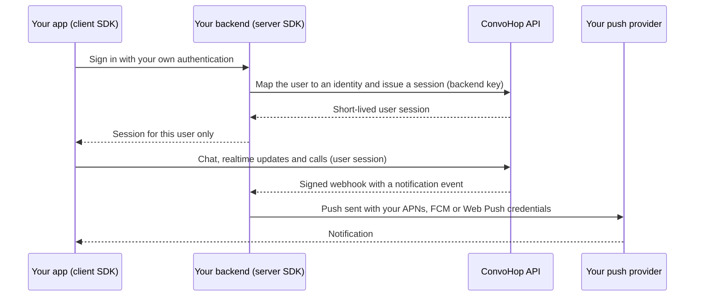

# ConvoHop SDK strategy

This document is the public plan for the ConvoHop SDKs. It covers how the SDKs
are split, which languages and platforms they cover, how push notifications
work, what the packages are called, and how they're versioned and supported.

> [!IMPORTANT]
> The SDKs are pre-release. No package has been published to a package
> registry yet, and every package is at version 0.x. Until registry
> publishing starts, releases of the TypeScript packages are attached to
> GitHub Releases in this repository. This document is the plan of record.
> It changes only through reviewed pull requests to this repository.

## At a glance

| Layer | Credential | Languages and platforms | Available today as source |
| --- | --- | --- | --- |
| Server SDKs | Secret backend key | Node.js (TypeScript), Python, .NET, Java and Kotlin, Go | Node.js: [`@convohop/server`](../packages/server/README.md) |
| Client SDKs | Short-lived session for one user | Web (TypeScript) with React hooks, iOS and macOS (Swift), Android (Kotlin), React Native, Flutter | Web: [`@convohop/client`](../packages/client/README.md) |

Everything else in this document is planned unless it says otherwise.

## Two layers, split by credential and runtime

Every ConvoHop SDK belongs to one of two layers. What decides the layer is the
credential the SDK holds and where the code runs, not which features it has.
Both layers can read message history and send messages. They differ in whose
authority they act with and where they can safely run.

The reason is simple. Anything you ship to a browser or a phone can be
extracted by the person using it. A secret that can act across a whole project
has to stay on servers that you control. Code on end-user devices should only
ever hold a credential that's limited to one user and expires quickly.

| | Server SDKs | Client SDKs |
| --- | --- | --- |
| Credential | A secret backend key, scoped to one project and to specific permissions. Organization and project management uses a separate management credential. | A short-lived session for one signed-in user on one device, issued by your backend |
| Where it runs | Trusted runtimes that you operate: application backends, workers, bots and AI agents, scheduled jobs | End-user devices: browsers, and iOS, macOS, Android, React Native and Flutter apps |
| Scope | Your whole project, limited by the key's permissions | What that one user is allowed to see and do |
| Realtime | Signed webhooks | WebSocket subscriptions with reconnect and replay |
| Voice and video | Call control and call reads, no media | Media through the platform's official LiveKit SDK |
| Local state | None per user. Optional recovery storage lets an interrupted request be resolved or retried safely. | Optional recovery storage today. A reactive store, offline cache and optimistic sends are planned. |

### Server SDKs

Server SDKs run only in trusted runtimes that you operate. Keep their
credentials in a secret store, and never send them to a device.

They cover the control plane:

- Map your authenticated users to ConvoHop identities, and issue, renew and
  revoke their short-lived client sessions.
- Create conversations, and manage members, roles and permissions.
- Moderate messages and control calls.
- Manage projects, backend keys and webhooks.

Server SDKs aren't only admin tools. They also cover the data plane, so your
backend, bots and AI agents can work with conversations directly:

- Read conversation history, get individual messages and search messages.
- Read a user's inbox.
- Send messages as a bot or system identity, or on behalf of a user with an
  audit trail.
- Read calls and call history.
- Verify and parse webhook events.

> [!NOTE]
> Backend keys reach the data plane through three backend-key scopes:
> `messageRead`, `messageWrite` and `callRead`. Each one is granted
> explicitly, so a backend key doesn't get access to everyone's messages by
> default. The Node.js server SDK covers management, identities and
> sessions, conversations and membership today. Its data-plane methods are
> in development.

Server SDKs don't open end-user media connections. Joining calls from
server-side agents might come later.

### Client SDKs

Client SDKs run on end-user devices. They authenticate with a short-lived
session for one signed-in user. Your backend creates that session with a
server SDK after it has authenticated the user with your own sign-in, and
then hands it to the app. Client SDKs never see backend keys.

A client SDK can do what that user is allowed to do:

- Read their inbox and the conversations they belong to.
- Send, edit and delete messages, and send typing indicators and read
  receipts.
- Receive realtime updates over a WebSocket subscription. A reconnect resumes
  after the last event your app applied. A replay position that's no longer
  valid is reported to your app instead of being silently skipped.
- Start, join and leave calls, and publish and receive audio and video
  through the platform's official LiveKit SDK.
- Handle the push notifications that you deliver. See
  [push notifications](#push-notifications-bring-your-own).

### How the layers work together

## Languages and platforms

### Server SDKs

| Language | Idioms | Status |
| --- | --- | --- |
| Node.js (TypeScript) | Promise-based, ESM | Source available |
| Python | Synchronous and `asyncio` clients | Planned |
| .NET (C#) | `async` methods with `CancellationToken` | Planned |
| Java and Kotlin | Java core, plus Kotlin coroutine extensions | Planned |
| Go | `context.Context` first | Planned |

We don't plan PHP or Ruby SDKs. From any other language you can call the
GraphQL API directly. The schemas in [`schema/`](../schema) describe it.

### Client SDKs

| Platform | Language | Media | Status |
| --- | --- | --- | --- |
| Web | TypeScript | LiveKit JavaScript SDK | Source available |
| React | Hooks on top of the Web SDK | Same as Web | Planned |
| iOS and macOS | Swift | LiveKit Swift SDK | Planned |
| Android | Kotlin | LiveKit Android SDK | Planned |
| React Native | TypeScript, sharing `@convohop/core` and `@convohop/client` with Web | LiveKit React Native SDK | Planned |
| Flutter | Dart | LiveKit Flutter SDK | Planned |

### How the SDKs are built

- **One spec, many targets.** The GraphQL schemas exported by the ConvoHop API
  are the source of truth. Annotations record which layer can call each
  operation, the credential it needs, and how it paginates, retries and
  streams. Together they compile into a language-neutral intermediate
  representation (IR). Generators turn the IR into models, operations and
  reference docs for each language, so every SDK exposes the same operations
  with the same behavior.
- **A small hand-written runtime per language.** Transport, authentication,
  retries with backoff, request IDs for idempotency, typed errors,
  pagination, timeouts and telemetry hooks are written once for each language
  and shared by all generated code.
- **Idiomatic, not transliterated.** Each SDK follows its language's naming,
  async, cancellation and error-handling conventions instead of copying
  TypeScript.
- **A native core for each client platform.** Client SDKs have a core in
  TypeScript, Swift, Kotlin or Dart that wraps the platform's official LiveKit
  SDK. The layers are: generated protocol, then the core client (transport,
  authentication and reconnect), then a state store, then framework bindings
  (React and React Native hooks, SwiftUI, Jetpack Compose and Flutter
  widgets). UI kits might come later.
- **Shared conformance tests.** A language-neutral suite of scenarios runs
  against every SDK in CI. It covers authentication, retries and idempotency,
  pagination, replay, errors and webhook verification. TypeScript is the
  reference implementation. An SDK isn't released until it passes the suite.

Today the annotations, the IR and its TypeScript and reference-snippet
generators exist. `npm run generate:graphql` generates the operations and
types in `@convohop/core` and one reference snippet per operation from
[`schema/`](../schema). See [SDK generation](sdk-generation.md). The
[conformance suite](../spec/conformance/README.md) runs its scenarios through
a TypeScript reference driver against a deterministic mock, and can target a
real deployment. The generators for other languages are in development.
Later, the same IR could also generate a command-line tool and tools for AI
agents.

### Calls with the official LiveKit SDKs

The iOS, macOS, Android, React Native and Flutter SDKs join calls with the
official LiveKit SDK's standard `connect(url, token)`. They send no custom
frames.

1. Join the call. Read the participation again. If it has a
   `nativeConnectionId`, call `liveSessionCredentials` with `mode: RECONNECT`
   and that ID as `replacementOfConnectionId`. Otherwise use `mode: INITIAL`.
2. Connect with `livekitUrl` and `connectToken` from the result. The token
   is a LiveKit access token for one room and one participant. It expires
   with the media lease, within 60 seconds. Its permissions match the
   participation: broadcast viewers can only subscribe, and publishers can
   publish only their allowed sources.
3. A token admits at most one connection. Another new connection with it
   fails with HTTP 403 before the WebSocket opens. LiveKit SDKs report this
   as a not-allowed error.
4. LiveKit's own resume works within the token's lifetime. The media server
   also sends refresh tokens through LiveKit's standard refresh. A refresh
   token can only resume that connection.
5. Anything else needs new credentials. This includes a full reconnect, a
   not-allowed error, an app restart and a resume after the token expired.
   Repeat step 1. After a successful join, `room.localParticipant.sid` equals
   `nativeConnectionId`.
6. Leaving, removal from the conversation, other membership or policy
   changes, and the end of the call all stop media. The media server removes
   the participant at its next lease renewal, every 20 seconds, and resume
   then fails.

Treat `connectToken` as a password. Don't log or store it, and send it only
to `livekitUrl`. The Web SDK uses its own first-frame admission with the same
rules. Only the ConvoHop media server accepts either path; a stock LiveKit
server can't.

## Push notifications: bring your own

ConvoHop doesn't send push notifications for you, and it never stores device
tokens. You keep control of:

- Your push credentials: APNs keys or certificates, Firebase Cloud Messaging
  service accounts and Web Push (VAPID) keys.
- Device tokens and push subscriptions, stored in your own backend.
- Notification text, localization and branding.
- Your delivery tooling. Send directly to APNs, FCM and Web Push, or through a
  push or engagement service that you already use.

How it works:

1. Your app registers for push with the platform as usual. Client SDK helpers
   hand the device token or Web Push subscription to your app, and your app
   sends it to your backend.
2. When a user should be notified, ConvoHop sends your backend a signed
   webhook with a per-recipient notification event. Examples are a new
   message in one of their conversations, an incoming call, or a call that
   stopped ringing. Events carry identifiers, such as the recipient,
   conversation, message, sender and call, and leave out the message text by
   default. Including message text is a per-project opt-in.
3. Your backend verifies the webhook with a server SDK, looks up the
   recipient's devices, builds the payload with server SDK helpers, and sends
   it through your provider.
4. On the device, the client SDK parses the notification, opens the right
   conversation or call, and fetches any content with the user's own session.

> [!NOTE]
> Per-recipient notification events, and webhook delivery to your endpoints,
> are in development. Event names and fields aren't final.

The SDK helpers are all optional:

| SDK | Helpers |
| --- | --- |
| Server, all languages | Webhook signature verification (timestamp tolerance, constant-time comparison, secret rotation) with typed events. Payload builders for APNs alerts, APNs VoIP (PushKit), FCM data messages and Web Push. |
| Web | A service-worker helper that uses your VAPID keys |
| iOS and macOS | A Notification Service Extension helper that fetches message content on the device with the user's session, so it never passes through the push service. PushKit-to-CallKit integration for incoming calls. |
| Android | Handling for high-priority FCM data messages, with a self-managed `ConnectionService` and a full-screen intent for incoming calls |
| React Native and Flutter | Wrappers around the iOS and Android helpers |

## Package names

These are the planned registry names. None of them has been published to a
registry yet.

> [!WARNING]
> Until a package is published from this repository, treat any registry
> package with one of these names, or a similar name, as untrusted. Release
> notes in this repository will list each official package when it's
> published. Until then, install the TypeScript packages from this
> repository's GitHub Releases, together with the `@convohop/core` release
> that they need, as described in
> [Installing and verifying a release](../RELEASING.md#installing-and-verifying-a-release).

| Ecosystem | Server SDK | Client SDKs |
| --- | --- | --- |
| npm | `@convohop/server` | `@convohop/client` (Web), `@convohop/react`, `@convohop/react-native` |
| PyPI | `convohop` | None |
| NuGet | `ConvoHop` | None |
| Maven Central | `com.convohop:convohop-server` (Java), `com.convohop:convohop-server-kotlin` (Kotlin coroutines) | `com.convohop:convohop-android` |
| Go modules | `github.com/ConvoHop/sdks/go` | None |
| Swift Package Manager | None | `ConvoHop`, from `github.com/ConvoHop/convohop-swift` |
| pub.dev | None | `convohop` (Flutter) |

Notes:

- **npm.** `@convohop/core` holds the shared TypeScript protocol and runtime.
  It's installed as a dependency of the other packages, but it isn't a
  supported entry point, so don't import it directly. `@convohop/core`,
  `@convohop/client` and `@convohop/server` are developed in this
  repository, and their releases are attached to its GitHub Releases. The
  earlier transitional workspace names,
  `@convohop/browser-sdk` and `@convohop/server-sdk`, were removed before any
  release and were never published.
- **PyPI.** A single distribution, `convohop`, with the import package
  `convohop`. It includes both the synchronous and the `asyncio` clients.
- **NuGet.** `ConvoHop`. Optional add-ons, such as framework integrations,
  use the `ConvoHop.*` prefix.
- **Go.** The module lives in the `go/` directory of this repository, and
  releases are tagged `go/vX.Y.Z`. The package name is `convohop`, because
  `go` is a reserved word. From major version 2, the module path ends in a
  major-version suffix such as `/v2`, as Go modules require. Module paths
  are case-sensitive.
- **Swift Package Manager.** The Swift package needs `Package.swift` at the
  root of its repository, so it's distributed from a dedicated repository
  that will be created when the SDK is ready. We don't plan to publish to
  CocoaPods, because its trunk is scheduled to become read-only in December
  2026.
- **Maven Central and pub.dev.** These names need namespace ownership
  verification before the first release. They're confirmed when verification
  completes.

## Versioning

- Every package follows [Semantic Versioning 2.0.0](https://semver.org/).
- Each package is versioned and released on its own, with its own changelog
  and its own Git tags, such as `client-v0.2.0`. A Python release doesn't
  force a Go release.
- Release automation chooses versions from
  [Conventional Commits](https://www.conventionalcommits.org/en/v1.0.0/):
  - `fix`, `perf` and `revert` make a patch release.
  - `feat` makes a minor release, also while the package is at 0.x.
  - A breaking change makes a major release, or a minor release while the
    package is at 0.x.
- When a package is released, the packages in this repository that depend
  on it are released too, with at least a patch release. For example, a
  `@convohop/core` release also releases `@convohop/client` and
  `@convohop/server`.
- Prereleases, such as `0.3.0-rc.1`, are marked as prereleases on GitHub
  and use the `next` tag on npm.
- [RELEASING.md](../RELEASING.md) describes the release process.

### 0.x until general availability

Until a package reaches 1.0.0:

- A minor release (for example 0.3.0 to 0.4.0) can include breaking changes.
  The changelog lists them, with migration notes.
- A patch release (for example 0.3.1 to 0.3.2) contains only
  backward-compatible fixes and performance improvements. New features come
  in minor releases.
- To avoid surprises, pin to a single 0.x minor version. npm's default caret
  range, `^0.3.1`, already does this.

### From 1.0.0

- Breaking changes happen only in major releases.
- Before we remove an API, we deprecate it for at least one minor release,
  with the language's own mechanism. Examples are `@deprecated` in
  TypeScript, `@Deprecated` in Java and Kotlin, `[Obsolete]` in .NET,
  `DeprecationWarning` in Python and `Deprecated:` comments in Go.

### API and SDK versions

SDK versions are independent of the API. The API is served at an unversioned
`/graphql` endpoint for HTTP, and with the `graphql-transport-ws` protocol for
realtime. A `V1` prefix in type names identifies the current domain model,
not an API version that you select. SDKs reject responses and features that
they don't support instead of guessing.

## Support policy

### Release lines

| Phase | Supported |
| --- | --- |
| Before 1.0 (now) | Only the latest 0.x minor release of each package gets fixes, including security fixes. Upgrade to get them. |
| From 1.0 | The latest major version gets features and fixes. The previous major version gets security and critical fixes for at least 12 months after the next major version is released. |

### Runtimes and platforms

Supported versions follow each runtime's own support lifecycle. When an
upstream version reaches end of life, we can drop it in the next minor
release, with a note in the changelog. We don't drop a runtime in a patch
release.

| SDK | Supported versions |
| --- | --- |
| Node.js | Active LTS and Maintenance LTS releases: Node.js 22 and 24 today. Odd-numbered releases aren't supported. |
| Python | 3.11 and later |
| .NET | Targets `netstandard2.0`, for .NET Framework 4.7.2 and later, and the current .NET LTS release (`net10.0` today). Tested on the .NET releases that Microsoft supports. |
| Java and Kotlin | Java 11 and later, tested on Java LTS releases |
| Go | The two most recent Go releases, matching Go's own support policy |
| Web | The current and previous major versions of Chrome, Edge, Firefox and Safari. Calls need WebRTC. |
| React | 18 and later |
| iOS and macOS | iOS 15 and later, macOS 12 and later |
| Android | API level 24 (Android 7.0) and later |
| React Native | 0.76 and later, with the New Architecture |
| Flutter | The current stable release |

Today, CI verifies only the TypeScript packages, on Node.js 22 and 24. Each
other row becomes a CI requirement when that SDK lands.

## Releases and distribution

- Release automation keeps one release pull request open for every package
  with releasable changes. It bumps the versions and writes the changelogs.
  Merging it tags each release and creates its GitHub Release.
- Each release is built, tested and packed in GitHub Actions from the
  tagged commit. Its GitHub Release has the package, checksums and an SBOM
  (software bill of materials), with signed build provenance that you can
  check with `gh attestation verify`.
- Publishing uses short-lived OpenID Connect (OIDC) credentials (trusted
  publishing) on registries that support it, such as npm, PyPI, NuGet and
  pub.dev, with build provenance where the registry offers it. No long-lived
  registry tokens are stored. Maven Central releases are signed. Go modules
  are released with `go/vX.Y.Z` tags in this repository, and the Swift
  package with tags in its own repository.
- Registry publishing hasn't started, and the npm publish step is a dry run
  until it does. Until then, install a release from this repository's
  GitHub Releases, as described in
  [RELEASING.md](../RELEASING.md#installing-and-verifying-a-release), or
  build from source.

## Security model

- Backend keys and management credentials are secrets. Keep them in a secret
  store on servers that you control. Never put them in browser or app code,
  bundles, storage, URLs, logs, error reports or examples.
- Client sessions are short-lived, and scoped to one user and one device in
  one project. Your backend issues them only after it authenticates the user.
  A user ID sent by a client isn't proof of who the user is.
- The SDKs redact credentials from errors and diagnostics.
- Mutations carry a request ID. A retry reuses the original ID and payload
  within a bounded retry budget. A network failure is reported as an unknown
  outcome, not as success or failure.
- Recovery state that your app chooses to persist never contains tokens.
- Webhooks are signed. Verify the signature of every delivery before you
  trust it. The server SDKs will include verification helpers.

To report a vulnerability, see [SECURITY.md](../SECURITY.md).

## Feedback

To suggest a language, platform or capability, open a
[feature request](https://github.com/ConvoHop/sdks/issues/new/choose).
Changes to this document go through pull requests.
