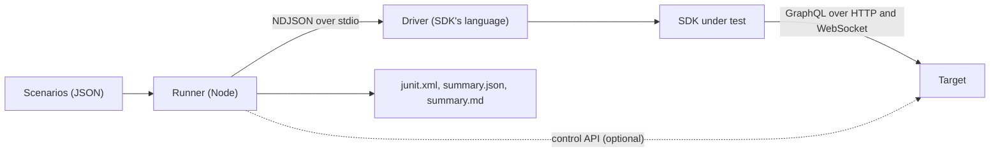

# ConvoHop conformance suite

Every ConvoHop SDK, in every language, must behave the same way against the
same service. This directory holds the language-neutral half of that
guarantee: the scenarios, their JSON Schemas, the shared operation catalog
and the webhook test vectors. The runner, the TypeScript reference driver and
the deterministic mock target live in [`conformance/`](../../conformance).

A scenario describes what an application does through an SDK and what it
must observe. The runner executes it against a **target** (a ConvoHop
deployment, or the built-in mock) through a **driver**: a small program,
written in the SDK's own language, that reads JSON commands on stdin, calls
the SDK and answers on stdout. An SDK conforms when its driver passes the
suite.



## Contents

| Path | Purpose |
| --- | --- |
| [`scenarios/`](scenarios) | Scenario suites, one JSON file per suite. |
| [`scenario.schema.json`](scenario.schema.json) | JSON Schema for suite files. |
| [`operations.json`](operations.json) | The [operation catalog](#operations) that scenarios and drivers share, with its [schema](operations.schema.json). |
| [`driver-protocol.md`](driver-protocol.md) | The runner-to-driver protocol, with its [schema](driver-protocol.schema.json). |
| [`targets.md`](targets.md) | Target descriptors, capabilities and the optional control API, with the [descriptor schema](target.schema.json). |
| [`webhook-signatures.md`](webhook-signatures.md) | The webhook signature scheme and its [vectors](vectors/webhooks.json), with their [schema](webhook-vectors.schema.json). |
| [`../push-payload/`](../push-payload/README.md) | The push payload contract and its [vectors](../push-payload/vectors.json), with their [schema](../push-payload/push-payload.schema.json). Each server SDK's own tests run these vectors, not drivers. |
| [`../recovery/`](../recovery/README.md) | The recovery journal and the retry and reconnect rules that every SDK follows, which the scenarios that need the `recovery.eviction`, `recovery.spentBudget` and `realtime.reconnectPolicy` features check. |
| [`conformance/runner.mjs`](../../conformance/runner.mjs) | The runner CLI; its modules are in [`conformance/lib/`](../../conformance/lib). |
| [`conformance/drivers/ts/`](../../conformance/drivers/ts) | The TypeScript reference driver. |
| [`conformance/drivers/jvm/`](../../conformance/drivers/jvm) | The driver for the [Java and Kotlin server SDK](../../jvm/README.md). |
| [`conformance/drivers/dotnet/`](../../conformance/drivers/dotnet) | The driver for the [.NET server SDK](../../dotnet/README.md). |
| [`conformance/drivers/go/`](../../conformance/drivers/go) | The driver for the [Go server SDK](../../go/README.md). |
| [`conformance/drivers/android/`](../../conformance/drivers/android) | The driver for the [Android client SDK](../../android/README.md). |
| [`conformance/drivers/dart/`](../../conformance/drivers/dart) | The driver for the [Flutter SDK](../../flutter/README.md). |
| [`conformance/drivers/react-native/`](../../conformance/drivers/react-native) | The driver for the [React Native SDK](../../packages/react-native/README.md). It runs the reference driver's protocol loop with the client on the React Native SDK's platform, in a Node.js process with React Native's globals and a fake of its native module. |
| [`conformance/drivers/swift/`](../../conformance/drivers/swift) | The driver for the [Swift client SDK](../../swift/README.md), a Swift package in `Driver/`. |
| [`conformance/mock/`](../../conformance/mock) | The deterministic mock target. |
| [`conformance/targets/`](../../conformance/targets) | Descriptors for real targets, such as the dev-stack image. |
| [`conformance/test/`](../../conformance/test) | `node:test` tests for the harness itself. |

## Coverage

Each scenario lists the areas it covers in `covers`. A scenario can cover
several areas.

| Area | `covers` tags | Scenarios | Examples |
| --- | --- | ---: | --- |
| User tokens | `auth.userToken` | 13 | Accepted, invalid, wrong project, non-member, user token used as a backend key |
| Backend keys | `auth.backendKey` | 12 | Accepted, invalid, wrong project, expired |
| Scopes | `auth.scopes` | 10 | A key without `membershipManage` gets `SCOPE_REQUIRED`, a management-issued scoped key, plane separation |
| Expiry | `auth.expiry` | 2 | Expired backend key; a short-lived user session that expires mid-scenario |
| CRUD | `crud` | 5 | Conversations, memberships and the message lifecycle, read back by other principals |
| Pagination | `pagination` | 3 | Member limit and cursor, newest-first message history, events after a cursor |
| Errors | `errors`, `errors.rateLimited` | 23, 5 | Revision conflicts, not found, invalid input, edits by members who are neither author nor moderator, `RATE_LIMITED` with retry-after, `RECOVERY_LIMIT`, `RESOLUTION_REQUIRED` once a retry budget is spent, realtime closes for `QUOTA_EXCEEDED` and `PLAN_LIMIT_EXCEEDED` |
| Idempotency | `idempotency` | 15 | Same-id replay from the same or a new client, payload conflicts, replay after a rate limit, same-id retry from a full recovery journal, no resend once a retry budget is spent |
| Recovery | `recovery` | 11 | Drops before and after commit, resolving a request id, recovery state across a restart, a full recovery journal that evicts final records, including those whose retry budget is spent, or fails closed |
| Webhook signatures | `webhooks.signature` | 14 | Valid, wrong secret, expired and future timestamps, multiple secrets, rotation |
| Realtime | `realtime.ordering`, `realtime.reconnect`, `realtime.resume` | 6, 7, 2 | Replay then live, subscriber agreement, server restart, revoked authorization, stored cursors, reconnecting after gateway errors and rate limits, stopping on quota and plan limits |

The suites are `auth` (14 scenarios), `crud` (4), `pagination` (3), `errors`
(9), `idempotency` (6), `recovery` (11), `realtime` (14) and `webhooks` (14),
for 75 in total. Run `npm run conformance -- --list` to print every
scenario with its tags and title.

Live sessions and native media are not covered. The client obtains a live
connection grant (including its `connectToken`) only while connecting
native media, which needs a real WebRTC transport and SFU; that belongs in
browser integration suites against a real service, not in a mock. Any
grant a target returns must still satisfy the schema, which requires
`connectToken`, and the runner redacts grant tokens from reports.

## Scenario format

A suite file holds one suite. Its `suite` must equal the file name without
`.json`.

```json
{
  "$schema": "../scenario.schema.json",
  "suite": "crud",
  "title": "Create, read, update and delete",
  "scenarios": [
    {
      "id": "crud.messages.lifecycle",
      "title": "A user sends, edits and deletes a message and another member sees each state",
      "covers": ["crud", "auth.userToken"],
      "steps": [
        { "do": "client.create", "client": "backend", "role": "backend", "credential": "${target.credentials.backend}" },
        { "do": "invoke", "client": "backend", "operation": "principals.create",
          "args": { "externalUserId": "alice-${nonce}" }, "save": "alice" },
        { "do": "invoke", "client": "alice", "operation": "messages.send",
          "args": { "conversationId": "${saved.conversation.conversationId}", "text": "hello" },
          "expect": { "value": { "status": "sent", "messageId": { "$type": "uuid" } } } }
      ]
    }
  ]
}
```

The example is abridged: the steps that create the conversation, issue a
session and open the `alice` user client are omitted.

A scenario has:

- `id`: `<suite>.<name>[.<name>...]` in lower kebab case, unique across all suites.
- `title`, and an optional `description`.
- `covers`: the [coverage](#coverage) tags.
- `requires.capabilities` (optional): target capabilities the runner cannot infer from the steps.
- `steps`: 1 to 200 steps, which run in order. The first failing step ends the scenario.

Every step has a `do` field and may carry a `note` for readers, which the
runner ignores.

| `do` | Fields | Effect |
| --- | --- | --- |
| `client.create` | `client`, `role`, `credential`, optional `principalId`, `projectId`, `incarnation`, `actorId`, `baseUrl`, `storage` | Creates an SDK client in the driver that serves `role` (`user`, `backend` or `management`). User clients need `principalId`. `storage` names a driver-side recovery store that clients can share, including across a simulated restart. |
| `client.close` | `client` | Closes the client and any subscriptions it owns. |
| `invoke` | `client`, `operation`, optional `args`, `requires`, `repeat`, `expect`, `save` | Runs a [catalog operation](#operations). Without `expect` the step only requires success. `expect` is `{"value": matcher}` or `{"error": matcher}`. `requires` lists driver [features](driver-protocol.md#features) the step needs. `repeat`, from 2 to 1000, runs the operation that many times in a row, each call a new request that must meet `expect`; `save` keeps the last result. |
| `realtime.subscribe` | `client`, `subscription`, `conversationId`, optional `requires`, `expect` | Opens the SDK's conversation event stream for a user client. With `expect.error` the subscription must fail with a matching error. `requires` lists driver features, beyond `realtime`, that the stream needs, such as `realtime.reconnectPolicy`. |
| `realtime.collect` | `subscription`, optional `until`, `timeoutMs`, `settleMs`, `expect`, `save` | Waits until `until` holds (`count` events, an event at or past `sequence`, and, with `closed: true`, a permanently ended stream), the stream ends, or `timeoutMs` (default 10 000, at most 60 000) elapses. `settleMs` then keeps collecting so late extras are caught. The result is `{events, errors, closed, timedOut}`. |
| `realtime.close` | `subscription` | Stops the subscription. |
| `webhooks.verify` | `vector` | Verifies a [webhook vector](webhook-signatures.md) offline. The result must equal the vector's `expected`. |
| `control.fault` | `field`, `action`, optional `plane`, `retryAfterSeconds`, `status`, `count` | Queues a [fault](targets.md#faults) for each of the next `count` (default 1) requests to a GraphQL root field: `rateLimit` (requires `retryAfterSeconds`), `dropBeforeCommit`, `dropAfterCommit` or `httpStatus` (requires `status`, from 400 to 599, and takes an optional `retryAfterSeconds`). |
| `control.realtimeDrop` | optional `conversationId`, `code`, `reason`, `expect` | Closes the target's realtime sockets, optionally only those subscribed to one conversation. `expect.closed` matches the number closed. |
| `control.waitLog` | `kind`, optional `match`, `count`, `timeoutMs`, `expect`, `save` | Waits for `count` (default 1) target log entries of `kind` (`request`, `subscribe` or `close`) whose fields equal `match`. `expect` matches the entries. |
| `sleep` | `ms` (at most 10 000) | Waits, for example to honour a retry-after delay. |

`save` stores a step's result for later steps under `${saved.<name>}`:
`invoke` saves its value, or its error when `expect.error` is given;
`realtime.collect` saves `{events, errors, closed, timedOut}`; and
`control.waitLog` saves the matching entries. The `control.*` steps need a
target with the matching [capability](targets.md#capabilities).

## Interpolation

Strings in the `client.create` fields, `args`, `conversationId`, `until`,
`expect` and the `control.*` step fields can contain `${...}` references.
Object keys are never interpolated.

| Reference | Value |
| --- | --- |
| `${target.<path>}` | A field of the [target descriptor](targets.md), such as `${target.credentials.backend}` or `${target.projectId}`. If the field is absent, the scenario is skipped. |
| `${saved.<name>.<path>}` | A value saved by an earlier step. Numeric segments index arrays, as in `${saved.page.items.0.messageId}`. |
| `${nonce}` | 16 hexadecimal characters, fixed for the scenario. Use it to make names unique on shared targets. |
| `${uuid.<label>}` | A random UUID per label, stable within the scenario. Use it for request ids and device ids. |
| `${clock.isoPlusMs.<n>}` | The current time plus `n` milliseconds as an RFC 3339 timestamp. Use it for expiry times. |

A string that is exactly one reference takes the referenced value's type,
so `"${saved.page.items}"` is an array. A reference embedded in longer text
must resolve to a string, number or boolean.

## Matchers

`expect` values are matchers:

- Strings, numbers, booleans and `null` must be equal.
- Arrays must have the same length, and each element must match.
- Objects match as subsets: every listed field must be present and match,
  and unlisted fields are ignored. Drivers return every selected field, so
  a field that should be empty is listed as `null`.
- An object whose keys start with `$` is an operator. It cannot mix
  operators with plain fields. Several operators in one object must all hold.

| Operator | Matches |
| --- | --- |
| `{"$type": t}` | The value has type `t`, or one of the types if `t` is an array. Types: `string`, `number` (finite), `integer` (safe integer), `boolean`, `null`, `object`, `array`, `uuid` (lowercase, not nil), `counter` (canonical decimal string up to 2^63-1) and `timestamp` (RFC 3339 with 0 to 9 fractional digits). |
| `{"$length": n}` | An array with `n` elements, or a string with `n` code points. |
| `{"$each": m}` | An array whose every element matches `m`. |
| `{"$contains": m}` | An array with at least one element that matches `m`. |
| `{"$sequences": {"from": a, "to": b}}` | An array of items whose `sequence` counters are exactly `a`, `a + 1`, ..., `b`, in order. |
| `{"$eq": v}` | Deep equality with `v`, with no subset matching. |
| `{"$ne": v}` | Anything not deeply equal to `v`. |
| `{"$anyOf": [m, ...]}` | At least one of the matchers. |
| `{"$gte": v}`, `{"$lte": v}` | Numbers compare with numbers. Counters compare with counters as arbitrary-precision integers. |

Sequences, revisions and other SQL counters are canonical decimal strings,
never JSON numbers, so values past 2^53 survive every language. Failures
report a JSON Pointer to each mismatching value.

## Operations

[`operations.json`](operations.json) is the catalog of logical operations
that scenarios invoke. Every driver maps each operation to its SDK's
idiomatic call and returns the JSON projection that the operation's
`returns` describes in terms of [`schema/`](../../schema) GraphQL types, with
every selected field present (`null` when absent) and counters as decimal
strings.

| Operation | IR operation | Roles | Arguments (optional in *italics*) |
| --- | --- | --- | --- |
| `route.initialize` | `communication.route` | user, backend | none |
| `principals.create` | `communication.createPrincipal` | backend | `externalUserId` |
| `sessions.issue` | `communication.issueSession` | backend | `principalId`, `deviceId`, *`requestedTtlMs`* |
| `conversations.create` | `communication.createConversation` | backend | `input`, *`requestId`* |
| `conversations.get` | `communication.getConversation` | user, backend | `conversationId` |
| `members.list` | `communication.members` | backend | `conversationId`, *`limit`*, *`cursor`* |
| `members.add` | `communication.addMembers` | backend | `conversationId`, `members`, *`requestId`* |
| `messages.send` | `communication.sendMessage` | user, backend | `conversationId`, `text`, *`actAs`*, *`requestId`* |
| `messages.list` | `communication.messages` | user, backend | `conversationId`, *`beforeSequence`*, *`actAs`* |
| `messages.edit` | `communication.editMessage` | user, backend | `message`, `text`, *`requestId`* |
| `messages.delete` | `communication.deleteMessage` | user, backend | `message`, *`requestId`* |
| `events.list` | `communication.events` | user | `conversationId`, *`after`* |
| `requests.resolve` | `communication.resolveRequest` | user | `requestId` |
| `requests.retry` | `communication.resolveRequest` | user | `requestId` |
| `backendKeys.issue` | `management.issueBackendKey` | management | `projectId`, `name`, `scopes`, `expiresAt` |

The catalog is the contract between scenarios and drivers, so changing it
means updating every driver. A driver may implement a subset; scenarios that
use an operation a driver does not declare are skipped, not failed.
`actAs` is for backend clients only: it names the member principal a backend
key reads or sends as, and the authority audits it. Scenarios pass it only
from backend clients, and the reference driver rejects it from user clients
with `INVALID_PARAMS` rather than ignore it.

### Alignment with the IR

Each operation names the operation it exercises in
[`schema/ir.json`](../../schema/ir.json), the language-neutral IR
that SDK generators read (see [SDK generation](../../docs/sdk-generation.md)),
and `realtime.irChannel` names the IR channel that subscriptions use.
`requests.retry` maps to `communication.resolveRequest` because it resolves
the original request first and resends its payload only when the authority
has not observed it. The harness tests in
[`conformance/test/spec.test.mjs`](../../conformance/test/spec.test.mjs)
check the catalog, the scenarios and the [mock target](targets.md#mock-target)
against the IR, so `npm test` fails when they drift apart:

- The IR operation exists and accepts the credential of every role that may
  call it (`userSession` for user, `backendKey` for backend and
  `portalCredential` for management clients) in a layer that runs where
  that credential does.
- Arguments named like an IR pagination field are the operation's own
  cursor or limit field, and paged operations accept the cursor.
- Operations that take a `requestId` belong to an idempotency class that
  retries the same request and can resolve it. Operations that map to
  `communication.resolveRequest` are exempt, because their `requestId` names
  the request to resolve, and must take one.
- The channel's subscription accepts user sessions, and the catalog covers
  the channel's replay and endpoint operations.
- After each `control.realtimeDrop`, and before the next one, the first
  `realtime.collect` on each dropped subscription expects the subscription
  to have ended exactly when the
  [realtime close rules](../recovery/README.md#realtime-closes) end it. A
  reason that starts with an error code decides by that code, which must be
  one the channel's subscription can fail with. Any other close decides by
  whether the IR lists its close code as terminal. Scenarios drop with both
  kinds of close code, and with reasons that name both kinds of error code.
- After a close that ends the subscription, the scenario checks the `subscribe` log with
  a `control.waitLog` that has an `expect`, and sleeps longer than the first
  reconnect delay (`baseDelayMs` plus `jitterMs`) before that check, so a
  reconnect would have been logged.
- Every error code a scenario expects is one the IR lists for the step's
  operation, or for the channel's subscription in realtime steps. A
  `requests.retry` step may expect any IR code, because the retry resends
  the original mutation. Error code names appear only in the code fields of
  `expect.error` and `expect.errors`, so none escapes this check.
  Codes listed in the test's `PENDING_ERROR_CODES` are accepted until the
  IR defines them; the test then reports that the exception can go.
- An expected error that pins an HTTP `status` uses the status the IR gives
  its code.
- The mock's backend-key scopes and GraphQL document size limit
  (`transport.http.maxDocumentBytes`) are the IR's. For each operation the
  catalog and its channel cover, the mock accepts a user session exactly
  when the IR has a `userSession` rule, and refuses every backend key with
  `FORBIDDEN` when it has no `backendKey` rule. Otherwise a key that holds
  exactly the scopes of a rule is authorized, and a key missing a scope that
  leaves no rule satisfied gets `SCOPE_REQUIRED`, with a message that names
  the scope.
- Every problem the mock raises has a literal code that the IR defines, with
  the IR's HTTP status for that code. The exceptions are pending codes, as
  above, and the mock's own `METHOD_NOT_ALLOWED`, `UNSUPPORTED_MEDIA_TYPE`
  and `MOCK_FAILURE`, which generated SDK requests never trigger unless the
  mock itself fails.

The test also reports how many IR operations the catalog covers.

## Static checks

Before anything runs, every suite is checked, and any problem stops the run
with exit code 2:

- The file validates against [`scenario.schema.json`](scenario.schema.json),
  its `suite` matches its file name, and every id starts with `<suite>.` and
  is unique across suites.
- Every `${...}` reference is well formed, and `${saved.<name>}` refers to a
  name saved by an earlier step. Save names are unique within a scenario.
- Client and subscription handles are opened before use and never reopened.
- User clients have a `principalId`, and no other role does. Only
  management clients take `actorId`, and they never take `projectId` or
  `incarnation`.
- Each operation exists in the catalog, its arguments are known and
  required ones are present, and the client's role may call it.
- A repeated `invoke` doesn't fix `args.requestId`, because each call is a
  new request.
- Only user clients subscribe, webhook vectors exist, and matchers are well
  formed.

The checks also derive what each scenario needs: roles, `role:operation`
pairs, driver features (`storage` needs `recovery.storage`, subscribing needs
`realtime`, `webhooks.verify` needs `webhooks.verify`, and an `invoke` or
`realtime.subscribe` step needs what its `requires` lists, for its client's
role), target capabilities
(each `control.*` step needs its own, plus `requires.capabilities`) and
target fields (each `${target.*}` reference, and `managementUrl` and
`managementActorId` for management clients that do not set `baseUrl` and
`actorId`).

## Execution

The runner starts the driver under test (the primary) and completes the
[`hello`](driver-protocol.md#hello) handshake, in which the driver declares
its roles, operations and features. If the selected scenarios need a role
the primary does not declare, the runner also starts a **fixture driver**
(the TypeScript reference driver by default) for those roles. For example,
a client-only SDK needs a backend client to create principals and issue
session tokens. Each client goes to the primary if it declares the role,
otherwise to the fixture driver. Webhook verification always runs on the
primary.

A scenario is **skipped**, with the reason recorded, when:

- no driver declares one of its roles;
- it uses only roles the primary lacks, so it would not exercise the SDK under test;
- the serving driver does not implement one of its operations or declare one of its features;
- the target lacks a required capability or descriptor field; or
- a `${target.*}` reference resolves to nothing at run time.

Otherwise the runner sends `reset` to every started driver and, when the
target has the `control.reset` capability, resets the target. It then runs
the steps in order. Driver requests time out after 90 seconds for `invoke`
and `realtime.subscribe`, and 10 seconds after the step's `timeoutMs` plus
`settleMs` for `realtime.collect`. A driver that crashes, writes something other than
protocol responses to stdout or misses a timeout fails the current scenario
and is restarted. The restarted driver must answer `hello` exactly as
before; otherwise it is marked unusable and later scenarios fail.

Failure messages and setup errors leave out the credentials the runner
knows: target credentials, credentials passed to `client.create`, and result
fields named `sessionToken`, `token`, `accessToken`, `credential`,
`connectToken` or `transportToken` become `[redacted]` (values of 8
characters or more). Once the runner has seen a value, it stays redacted for
the rest of the run, because a driver's stderr can repeat what an earlier
scenario used. Messages are truncated to 1000 characters. A failed driver's
last 15 lines of stderr are appended, or its last 10 lines when it fails its
handshake or a restart. The runner cannot recognize bearer material it never
saw, such as a token an SDK refreshes internally, so drivers must not log
credentials or tokens.

## Running

```sh
npm ci
npm run conformance           # run every scenario against the mock
npm run conformance -- --filter realtime --filter errors.rate-limited
npm run conformance -- --target conformance/targets/dev-stack.json
npm run test:conformance      # the harness's own tests (also part of npm test)
npm run generate:conformance  # regenerate vectors/webhooks.json and ../push-payload/vectors.json
```

The harness is the private `conformance` npm workspace. It is never
published or released and depends on the SDK packages through workspace
links. `npm run conformance` runs `npm run build`, which builds the SDK
packages and then the reference driver, and then runs
`node conformance/runner.mjs` with any arguments after `--`. The runner's
options:

| Option | Meaning |
| --- | --- |
| `--target <mock\|file>` | `mock` (the default) starts the built-in deterministic mock. Otherwise, a [target descriptor](targets.md) JSON file. |
| `--driver <command>` | The driver under test. The default is the TypeScript reference driver. The command is split on whitespace, with quotes grouping words, and run without a shell. A leading `node` means the Node binary running the runner. |
| `--fixture-driver <command\|none>` | The driver for roles the driver under test lacks. The default is the reference driver; `none` disables it. |
| `--scenarios <dir>` | The scenario directory. The default is `spec/conformance/scenarios`. |
| `--filter <pattern>` | Repeatable. Runs scenarios whose id equals the pattern or starts with `<pattern>.`, or, if the pattern contains `*`, matches it as a wildcard. |
| `--reports <dir>` | The report directory. The default is `conformance/reports`, which is git-ignored. |
| `--strict` | Treats skipped scenarios as failures. |
| `--list` | Checks and lists the selected scenarios without running them. |

Exit codes:

| Code | Meaning |
| ---: | --- |
| 0 | Every selected scenario passed, or was skipped without `--strict`. |
| 1 | A scenario failed, or was skipped under `--strict`. |
| 2 | A usage, spec, target or driver setup error. The message starts with `conformance:`. |

Each run writes three reports: `junit.xml` (one test suite per scenario
suite, with skips and failures), `summary.json` (machine-readable, including
the driver's name, roles and features and the target's capabilities) and
`summary.md`.
When `GITHUB_STEP_SUMMARY` is set, the Markdown summary is also appended to
the GitHub Actions job summary.

`npm run test:conformance` builds the reference driver and the packages it
references and runs the harness's own `node:test` suites in
[`conformance/test/`](../../conformance/test): the
schemas, catalog, scenarios and webhook vectors; the
[push payload vectors](../push-payload/README.md#vectors), against rules
written independently of the builders; the runner's modules; the mock;
the driver client, against a scriptable fake driver; the
[dev-stack start script](targets.md#dev-stack-target), against a scriptable
fake Docker CLI; and end-to-end runner invocations, including the reference
driver against the mock and a dev-stack descriptor pointed at a local mock.

[SDK CI](../../.github/workflows/sdk-ci.yml) runs those tests on Node.js 22
and 24 as part of `npm test`. The `mock` job of the
[Conformance workflow](../../.github/workflows/conformance.yml) runs
`npm run conformance -- --strict` on Node.js 24 and uploads the reports as
the `conformance-reports-mock` artifact. The mock offers every capability
and the reference driver declares every feature, so a skip there is a
regression. Its `dev-stack` job is described under
[dev-stack target](targets.md#dev-stack-target). The
[release workflow](../../.github/workflows/release.yml) runs every npm check
that CI runs, so it also runs `npm run conformance -- --strict` before it
packs a release; `npm run check:release` enforces that.

The `conformance` job of the [Flutter workflow](../../.github/workflows/flutter.yml)
builds the [Dart driver](../../conformance/drivers/dart) and runs the
scenarios with it against the mock, without `--strict`, and uploads the
reports as the `conformance-reports-dart-mock` artifact. The Dart driver
declares only the user role, so the reference driver provides the other
roles, and scenarios that need what it doesn't declare are skipped.

The `conformance` job of the
[React Native workflow](../../.github/workflows/react-native.yml) runs the
scenarios with the [React Native driver](../../conformance/drivers/react-native)
against the mock, without `--strict`, and uploads the reports as the
`conformance-reports-react-native-mock` artifact. The driver declares only
the user role, so the reference driver provides the other roles, and
scenarios that need what it doesn't declare are skipped. The harness's
tests also run a few scenarios through it.

### Current results

The TypeScript reference driver passes all 75 scenarios against the mock,
with none skipped, including the 14 `webhooks` scenarios,
`errors.rate-limited.retry-after` and the 11 that need `recovery.eviction`,
`recovery.spentBudget` or `realtime.reconnectPolicy`.

The JVM driver declares the backend and management roles. It passes 73
scenarios against the mock and skips the 2 that only use user clients,
`auth.user-token.invalid` and `realtime.subscribe.invalid-token`. Its
[workflow](../../.github/workflows/jvm.yml) fails on any other skip.

The .NET driver declares the backend and management roles too. With both
the `net10.0` and the `netstandard2.0` builds of the SDK, it passes 73
scenarios against the mock and skips the same 2. Its
[workflow](../../.github/workflows/dotnet.yml) fails on any other skip.

The Python driver declares the backend and management roles too. With both
the sync and the async clients, it passes 73 scenarios against the mock and
skips the same 2. Its [workflow](../../.github/workflows/python.yml) fails
on any other skip.

The Go driver also declares the backend and management roles, and the
`recovery.eviction` and `recovery.spentBudget` features. It passes 73
scenarios against the mock and skips only the 2 that only use user
clients. Its [workflow](../../.github/workflows/go.yml) fails on any other
skip.

The Android driver declares only the user role and no `webhooks.verify`
feature. It declares `recovery.eviction` and `realtime.reconnectPolicy`, so
it passes 40 scenarios against the mock and skips 35: those that use only
backend or management clients, those that verify webhooks, and the one that
needs `recovery.spentBudget` with a user client, until its SDK follows the
[spent-budget rule](../recovery/README.md#final-records). Its
[workflow](../../.github/workflows/android.yml) fails on any other skip.

The Dart driver also declares only the user role and no `webhooks.verify`
feature. It declares `recovery.eviction`, `recovery.spentBudget` and
`realtime.reconnectPolicy`, so it passes 41 scenarios against the mock and
skips 34: those that use only backend or management clients, and those that
verify webhooks. Its [workflow](../../.github/workflows/flutter.yml) fails
on any other skip.

The React Native driver declares only the user role and no
`webhooks.verify` feature. It passes 41 scenarios against the mock and
skips 34: those that use only backend or management clients, and those that
verify webhooks. It inherits the TypeScript client's recovery and reconnect
behaviour, so it declares `recovery.eviction`, `recovery.spentBudget` and
`realtime.reconnectPolicy`. Its [workflow](../../.github/workflows/react-native.yml)
fails on any other skip. It runs on Node.js, not Hermes, with a fake of the
native platform module.

The Swift driver also declares only the user role and no `webhooks.verify`
feature. It passes 33 scenarios against the mock and skips 42: those that
use only backend or management clients, those that verify webhooks, and the
8 that need `recovery.eviction`, `recovery.spentBudget` or
`realtime.reconnectPolicy` with a user client, until its SDK follows the
[recovery and reconnect rules](../recovery/README.md). On Linux it doesn't
declare `realtime`, because Ubuntu's libcurl has no WebSocket support. There
it passes 24 scenarios and also skips the 9 realtime ones. Its
[workflow](../../.github/workflows/swift.yml) fails on any other skip.

Passing against the mock shows that the SDK, driver and scenarios agree on
the public contract. It does not certify a real deployment; for that, run
the suite against a real target.

## Adding a scenario

1. Add it to the suite file in [`scenarios/`](scenarios) that matches its
   area, or create `scenarios/<suite>.json` for a new area.
2. Use only catalog operations, `${nonce}` for anything that must be unique
   on a shared target, and `${uuid.<label>}` for request ids.
3. Invoke `route.initialize` on each backend and user client right after
   creating it. A real server rejects their other commands with 409
   `WRONG_REGION` until the client has the current serving epoch, which the
   mock does not check. Authentication comes first, so only a command that
   must fail with `UNAUTHENTICATED` may precede it.
4. Pin observable public behaviour only. Do not pin internal event type
   names, timings or a particular SDK's retry strategy, beyond what the
   [recovery and reconnect rules](../recovery/README.md) require of every
   SDK. Expect only error
   codes that the IR lists for the operation (see
   [Alignment with the IR](#alignment-with-the-ir)).
5. Run `npm run test:conformance` for the static and IR checks, then
   `npm run conformance -- --filter <id>` against the mock, and against a
   real target when you have one.

## Adding a driver

A driver is a long-running program that speaks the
[driver protocol](driver-protocol.md) on stdio. Start from the TypeScript
reference driver in [`conformance/drivers/ts/`](../../conformance/drivers/ts):
it is small, keeps every SDK call in one module (`sdk.mts`) and shows how
to map SDK errors to the protocol's normalized form. Declare only the roles,
operations and features the SDK really supports, and run it with
`--driver "<command>" --strict` to see what it still skips.
