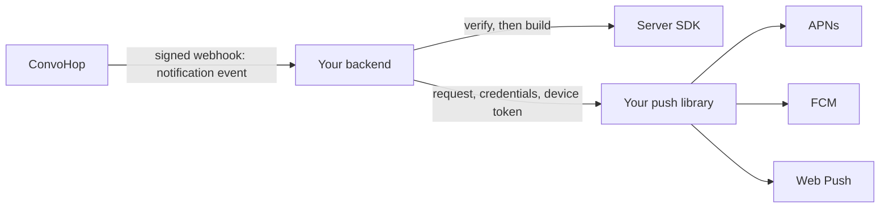

# Push payload contract

> [!IMPORTANT]
> Provisional. ConvoHop doesn't send notification events yet. The producer
> will conform to this contract when it ships, and event fields, lifetimes
> and payload layouts can change until then.

ConvoHop doesn't send push notifications for you
([bring your own](../../docs/sdk-strategy.md#push-notifications-bring-your-own)).
It sends your backend a signed webhook with a per-recipient notification
event. Your backend verifies the webhook, builds a push request from the
event, and sends it with your own push library, credentials and device
tokens. This directory is the language-neutral contract for those events and
for the requests the server SDKs build from them:

| File | Purpose |
| --- | --- |
| [`push-payload.schema.json`](push-payload.schema.json) | JSON Schema. The root validates one notification event. `$defs` describe the builder options, each platform's request and the vector file. |
| [`vectors.json`](vectors.json) | Shared test vectors: builder inputs with every builder's expected request, and invalid events. Generated; don't edit by hand. |

The TypeScript builders are `push` in
[`@convohop/server`](../../packages/server/README.md#push-payloads). Every
server SDK's builders must produce the vectors' requests.



## Events

Each recipient gets its own event. Three event types exist:

- `notification.message`: a message for the recipient.
- `notification.call`: an incoming call, as one ring for the recipient.
- `notification.callCancelled`: a ring that stopped for the recipient.

| Field | Events | Value |
| --- | --- | --- |
| `eventId` | All | UUID of the event. Retries and replays of its webhook keep it. |
| `eventType` | All | One of the three types. |
| `eventVersion` | All | `"1"`. |
| `occurredAt` | All | When the message was sent, the ring started or the ring stopped. |
| `projectId` | All | UUID. |
| `subjectRef` | All | `{ "id": <messageId>, "kind": "message" }`, or `{ "id": <liveSessionId>, "kind": "liveSession" }` for calls and cancellations. |
| `recipientId` | All | The principal to notify. |
| `conversationId` | All | UUID. |
| `senderId` | All | The principal who sent the message or started the ringing. |
| `connected` | All | Whether the recipient had an active realtime connection when the event was produced. |
| `messageId` | Message | UUID. |
| `preview` | Message, optional | `{ "text", "truncated" }`: the start of the message text. |
| `liveSessionId` | Call, cancelled | UUID of the call. |
| `alertId` | Call, cancelled | UUID of the ring. A later ring of the same call has a new `alertId`. A cancellation carries the stopped ring's `alertId`. |
| `expiresAt` | Call, cancelled | When the ring stops if nobody answers. A cancellation carries the stopped ring's original deadline. |
| `mediaProfile` | Call, cancelled | `AUDIO_ONLY`, `AUDIO_VIDEO` or a later profile. |
| `reason` | Cancelled | `answered`, `declined`, `ended`, `expired` or a later reason. |

Values follow these rules:

- **UUIDs** are lowercase, hyphenated and never the nil UUID.
- **Timestamps** are RFC 3339 with an uppercase `T`, and `Z` or an offset.
  They have at most nine fraction digits, name a date that exists and never
  use second 60. Lifetimes use whole seconds, so fractions are dropped.
- **Open enumerations** (`mediaProfile`, `reason`) are an ASCII letter
  followed by up to 63 ASCII letters, digits or underscores. Accept values
  you don't know.
- **`preview`** is present only when the project opts in to message previews
  and the message has text. `text` is 1 to 512 Unicode code points, without
  lone surrogates, and `truncated` says whether the message continues after
  it. It is the only message text an event carries; every other field is
  metadata.
- **`connected`** is a hint for your sending policy, for example to skip a
  push for a message the user is already watching. It isn't per device, and
  it can change before you send. Builders ignore it.
- **`reason`**: `answered` and `declined` mean the recipient answered or
  declined, on any device; they only stop the ringing. `ended` (the call
  ended or stopped ringing first) and `expired` (nobody answered by
  `expiresAt`) are missed calls. Treat a later reason as "stop ringing",
  without a missed call.

Producers send exactly these fields as [canonical JSON](#size-and-truncation),
and `subjectRef.id` equals `messageId` or `liveSessionId`. Every valid event
fits the 4096-byte webhook body limit: a 512-code-point preview takes at most
3072 bytes. Consumers ignore fields they don't know. An event with another
`eventVersion`, or one that breaks these rules, isn't a notification event:
webhook verifiers return it like an event type they don't know, and builders
reject it.

## Builders

Each SDK has four builders. They are pure functions: they take an event, the
options and a clock, and return a request or none. They hold no credentials
and send nothing. Your push library adds the device token, APNs or FCM
authorization, and Web Push encryption ([RFC 8291](https://www.rfc-editor.org/rfc/rfc8291))
and VAPID signing.

| Builder | Events | Measured part | Limit (bytes) |
| --- | --- | --- | --- |
| `apnsAlert` | Messages, calls, and missed calls (`reason` `ended` or `expired`) | `payload` | 4096 |
| `apnsVoip` | Calls | `payload` | 5120 |
| `fcm` | All | `message.data` | 4096 |
| `webPush` | All | `payload` | 3993 |

**Options.** `bundleId` is the app's bundle ID: letters, digits and hyphens
in dot-separated parts, at most 155 characters. The APNs builders require
it, and the others ignore it. `title` and `body` are the visible text, and an
empty string is the same as none. `preview` (default `true`) controls
whether a message event's preview becomes the body. Builders check the
options first, then the event, and fail with `INVALID_OPTIONS` or
`INVALID_EVENT` respectively. Text with a lone surrogate is invalid.

**Text.** The title is the `title` option. The body is the `body` option;
otherwise, for a message event with a preview and `preview` not `false`, it
is the preview's `text`, followed by `…` (U+2026) when `truncated` is true.
With no title, body or preview, a request carries metadata only.

**Lifetime.** A message and a missed call stay relevant for one day after
`occurredAt`. A call, and a cancellation that isn't a missed call, stay
relevant until `expiresAt`. The lifetime is the whole seconds from the clock
until then, at most 28 days (2419200 seconds). A builder returns no request
when the event doesn't apply to it or the lifetime is zero or less.

**Collapse.** Calls and cancellations collapse on the ring: their key is the
`alertId` without hyphens (32 hexadecimal digits). Messages don't collapse.

### Requests

Every request carries a `convohop` object
([`$defs/data`](push-payload.schema.json)): the event without
`eventVersion`, `subjectRef`, `connected` and `preview`. The APNs VoIP, FCM
and Web Push requests, which have no visible alert of their own, add `title`
and `body` to it.

- **APNs alert.** Headers: `apns-push-type: alert`, `apns-topic: <bundleId>`,
  `apns-priority: 10`, `apns-expiration` (the clock plus the lifetime, in Unix
  seconds) and, for calls and missed calls, the collapse key as
  `apns-collapse-id`. The payload is
  `{ "aps": { "alert", "sound": "default", "mutable-content": 1, "thread-id": <conversationId> }, "convohop" }`.
  The alert has the title and the body; without a body it has a `loc-key`:
  `CONVOHOP_MESSAGE`, `CONVOHOP_CALL` or `CONVOHOP_MISSED_CALL`. Define those
  keys in your app's `Localizable.strings`. `mutable-content` lets a
  Notification Service Extension fetch the content with the user's session
  and replace the alert.
- **APNs VoIP.** Headers: `apns-push-type: voip`, `apns-topic: <bundleId>.voip`,
  `apns-priority: 10` and `apns-expiration`, without a collapse ID. The
  payload is `{ "convohop" }`.
- **FCM.** An HTTP v1 `messages:send` message without a target: add `token`.
  `message.data.convohop` is the `convohop` object as canonical JSON (compare
  it after parsing). `message.android` is
  `{ "priority": "HIGH", "ttl": "<lifetime>s" }`, plus the collapse key as
  `collapse_key` for calls and cancellations. Firebase Admin SDKs take these
  options in their own form, so convert them. Android apps build the
  notification themselves; show one for every high-priority message, or
  Android can lower the app's later messages to normal priority. The request
  carries Android options only: send to Apple devices with the APNs
  requests. FCM stores at most four collapsible messages per device, with no
  guarantee which it keeps, so a device that is offline through more than
  four rings can miss some of them.
- **Web Push.** Headers ([RFC 8030](https://www.rfc-editor.org/rfc/rfc8030)):
  `TTL` (the lifetime), `Urgency` (`normal` for messages, `high` for calls
  and cancellations) and, for calls and cancellations, the collapse key as
  `Topic`. The payload is `{ "convohop" }`, which your Web Push library
  encrypts. Where the library sets `TTL`, `Urgency` or `Topic` from its own
  options, pass the values there, or its defaults replace them. Your service
  worker shows the notification.

### Calls on iOS

iOS requires an app to report every VoIP push to CallKit as an incoming
call, even one that has already stopped ringing: report it and then end it.
An app that doesn't is terminated, and iOS can stop delivering its VoIP
pushes. So `apnsVoip` builds requests for `notification.call` only, never
for cancellations. A cancellation reaches an iOS device as follows:

- **An app ringing through CallKit** is running. It ends the ringing when
  its realtime connection reports that the call stopped ringing for the
  user, or at `expiresAt` at the latest.
- **A missed call** (`ended` or `expired`) gets an APNs alert with the
  `CONVOHOP_MISSED_CALL` key and the ring's collapse ID, so it replaces an
  incoming-call alert for the same ring.
- **`answered`, `declined` and later reasons** get no APNs request, because
  an alert would show a notification for a ring the user already handled. An
  incoming-call alert that iOS already shows stays until the app removes it;
  match it on `convohop.alertId`.

An app without CallKit can send the APNs alert for `notification.call`
instead of the VoIP push.

## Size and truncation

Sizes are UTF-8 bytes of canonical JSON. Canonical JSON is the compact
output of ECMAScript's `JSON.stringify`: no whitespace, `\"` and `\\`, the
escapes `\b`, `\f`, `\n`, `\r` and `\t`, `\u00XX` with lowercase hexadecimal
digits for the other characters U+0000 to U+001F, and every other character
as itself, including `/`, U+007F, U+2028 and U+2029. Key order doesn't change
the size. Measure that form, so truncation matches the vectors, and send JSON
no larger than it, so a request stays within its limit. Some encoders escape
more: Go's `encoding/json`, for example, escapes `<`, `>` and `&` unless HTML
escaping is off, and always escapes U+2028 and U+2029.

FCM documents a 4096-byte limit for data messages without saying how it
counts them. The builders measure `message.data` as canonical JSON, which
counts the inner JSON's escapes twice, so it errs on the safe side. The Web
Push limit is the 3993 bytes of plaintext that, by RFC 8291, fit the
4096-byte body every push service accepts.

When a request is over its limit, the builder shortens the body and then, if
the request is still over, the title. Each becomes its longest prefix, in
whole code points, that fits when followed by `…`, or `…` alone when no
prefix fits. Metadata always fits.

## Vectors

[`vectors.json`](vectors.json) has `vectors` and `invalidEvents`. Run every
vector through each builder with the vector's `options` and a clock of
`nowSeconds` (Unix seconds), and check that:

- the builder returns no request where `expected.<builder>` is `null`, and
  otherwise returns `expected.<builder>.request`, comparing FCM's
  `data.convohop` after parsing;
- the canonical size of the measured part is `expected.<builder>.bytes`;
- the results don't change when the vector's `unknownFields`, fields the
  contract doesn't define for the event's type, are added to the event.

Each `invalidEvents` entry isn't a notification event under this contract.
Builders must reject it with `INVALID_EVENT`, and webhook verifiers must
return it as an unknown event without failing. The schema rejects it unless
`schemaValid` is true, which marks the rules JSON Schema can't express, such
as `subjectRef.id` naming the event's message. Lone surrogates have no
vectors, because many JSON libraries can't represent them; test them in each
SDK.

The vectors cover each event type with and without text, previews, escapes,
lifetimes at their edges, the 28-day cap, stale events, every builder's
limit exactly and one byte over, truncation between multibyte characters
and a title too long for any payload.
[`conformance/lib/push-vectors.mjs`](../../conformance/lib/push-vectors.mjs)
generates them by running the `@convohop/server` builders, and
[`conformance/test/push.test.mjs`](../../conformance/test/push.test.mjs)
checks them against rules written independently of the builders. To add or
change a vector, edit the generator, then run:

```sh
npm run generate:conformance
npm run test:conformance
```
